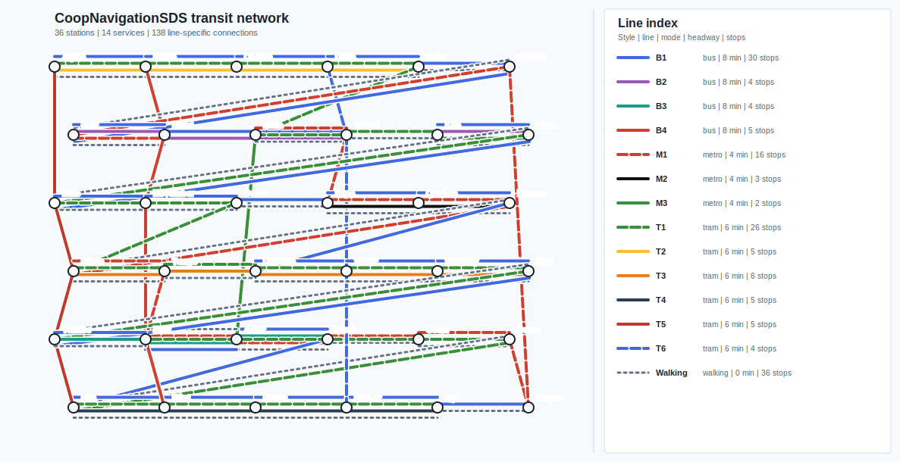

# CoopNavigationSDS

CoopNavigationSDS is a research framework for the automatic, phase-aware
evaluation of cooperative speech dialogue systems. Two agents solve a public
transport route-finding task:

- **Agent A** represents a caller who knows the start station, destination,
  departure time, valid station and line names, and private travel constraints.
- **Agent B** represents the dialogue system. It proposes grounded routes,
  responds to clarification and critique, and improves proposals as Agent A
  reveals constraints.

The framework is designed for controlled comparisons of language models,
text-to-speech systems, automatic speech recognition systems, personas,
scenarios, and speech conditions. It records raw phase evidence during the
dialogue and calculates all registered metrics retrospectively.

## Research Scope

The software supports research questions such as:

- Which phase-specific metrics best predict task completion and constraint
  satisfaction across language models of different sizes?
- Where does the earliest measurable failure occur in an unsuccessful speech
  dialogue?
- How do speech synthesis and recognition errors propagate into language
  understanding, dialogue policy, and route selection?
- Which clarification and repair behaviors prevent an acoustic or semantic
  error from becoming a task failure?
- Do larger language models improve grounded route proposals enough to justify
  additional latency and resource use?
- Are metric relationships stable across scenarios, repetitions, model
  families, and paired text/audio conditions?

The experiment is not a generic chatbot benchmark. It measures cooperation in
a bounded task with machine-verifiable routes, progressively revealed
constraints, known optimal baselines, and explicit success criteria.

## Pipeline

Every production turn traverses the complete speech dialogue pipeline:

```mermaid
flowchart LR
    C["Configuration"] --> P["Preflight"]
    P --> N["Network and staged optima"]
    N --> DM1["Dialogue policy selects speaker action"]
    DM1 --> NLG["Natural-language generation"]
    NLG --> TTS["Text-to-speech"]
    TTS --> A["WAV audio"]
    A --> ASR["Automatic speech recognition"]
    ASR --> NR["Domain normalization"]
    NR --> NLU["Language and route understanding"]
    NLU --> M["Listener-specific memory"]
    M --> DM2["Dialogue-state and policy update"]
    DM2 --> DM1
    M --> R["Immutable runtime evidence"]
    R --> E["Retrospective metrics"]
    E --> O["Research outputs"]
```



For Agent A to Agent B and Agent B to Agent A turns, the same stages run in
opposite speaker/listener directions. Time advances through the pipeline; no
phase is duplicated as a hidden alternate path.

### Phase Responsibilities

| Phase | Responsibility | Primary evidence |
| --- | --- | --- |
| Network and task | Generate the transport network, scenario, constraints, and staged optimal routes | Network graph, scenario state, constraint layers, optimal candidates |
| Agent policy | Select the current conversational objective and next action | Stage, active objective, candidate history, repair state |
| Natural-language generation | Express the selected action as concise dialogue | Intended utterance, model metadata, token use, generation latency |
| Text-to-speech | Convert the utterance into the audio heard by the other agent | Spoken text, prosody, WAV path, duration, synthesis diagnostics |
| Automatic speech recognition | Transcribe the generated audio | Raw transcript, confidence where available, recognition latency |
| Normalization | Apply conservative, logged transit-domain corrections | Raw and corrected tokens, final listener input |
| Natural-language understanding | Recover trip facts, constraints, intent, and route structure | Semantic frame, route parse, missing slots, validation flags |
| Dialogue state | Update only the listening agent's perspective-specific memory | Memory before/after, additions, retained candidates and constraints |
| Dialogue management | Progress, clarify, repair, compare, or close | Stage transition, warnings, repair outcome, stopping decision |
| Evaluation | Reconstruct metrics from stored evidence after completion | Formula, operands, substitution, result, availability reason |

## Experiment Integrity

The implementation enforces the following research contracts.

### Actual Speech Dependency

The listener reacts to the transcript produced by the configured speech
pipeline. Generated source text is never substituted for failed recognition.
If text-to-speech or automatic speech recognition fails, the condition stops
with diagnostics instead of silently switching engines.

The console keeps relevant representations distinct:

```text
TTS SPEECH:    Take tram line T1 from Bravo to Juliett.
ASR HEARD:     Take tram line T1 from Bravo to Juliet.
AGENT INPUT:   Take tram line T1 from Bravo to Juliett.
TTS -> ASR:    'Juliett' -> Juliet
ASR -> INPUT:  Juliet -> Juliett
```

`ASR HEARD` remains the raw recognizer output. `AGENT INPUT` is the actual
downstream transcript after any configured correction. Every correction is
retained as explicit evidence.

### Independent Agent Memory

The agents do not share a hidden memory:

- Agent A retains its caller setup, its intended utterances, and what it heard.
- Agent B retains only what it said and what it heard through the speech
  pipeline.
- Agent A does not receive network topology, schedules, or optimal routes.
- Agent B receives route-planning authority but must infer the caller's trip
  facts and stated constraints from its own conversation history.

Each turn records both memory snapshots, newly added information, unresolved
trip slots, current route candidates, active constraints, and repair focus.

### Reproducibility and Traceability

- Configuration schemas, trace schemas, and result schemas are versioned.
- Every run stores the resolved configuration, runtime environment, model and
  provider metadata, scenario, network seed, and random seeds.
- Credentials are redacted from persisted configuration.
- Missing evidence produces a `null` metric with an explicit reason, never a
  fabricated zero.
- Raw evidence is stored before derived metrics are calculated.
- Metric calculation can be repeated from `metric_inputs.json` without
  rerunning the conversation.
- Unsupported or missing models, executables, and assets fail preflight.
- Result files from all conditions use the same stable keys and schemas.

### Paired Controls

Batch experiments can automatically pair every audio condition with a
file-backed text control that has identical non-audio settings. Each pair
stores:

- `pair_id`;
- `run_type = text_only | audio_variant`;
- task-success delta;
- route-validity delta;
- constraint-satisfaction delta;
- turn-count delta;
- repair-turn delta;
- audio-error effect.

This isolates the effect of the speech channel from the task, model, persona,
scenario, and decoding condition.

## Transport Network and Dialogue Task

The transport network is a deterministic, seed-controlled experimental model.
It is generated before each condition and then becomes authoritative for route
search, proposal verification, staged optimal routes, and retrospective
metrics. Changing `network_seed` changes realized network values while
preserving the structural invariants below.

### Network Parameters

| Parameter | Default | Experimental meaning |
| --- | ---: | --- |
| Stations | 36 | Fixed station vocabulary |
| Service entries | 14 | 13 public lines plus walking |
| Public modes | metro, tram, bus | Ticket-constrained transport modes |
| Additional mode | walking | Available separately and limited cumulatively |
| Network seed | 42 | Reproduces lines, travel times, transfers, and demand |
| Public segment travel time | 2-6 min | Distance-, line-, and mode-specific |
| Walking segment travel time | 3-15 min | Distance-scaled and always longer than bus for the same connection |
| Metro headway | 4 min | Fastest and most frequent public mode |
| Tram headway | 6 min | Intermediate speed and frequency |
| Bus headway | 8 min | Broadest coverage and slowest public mode |
| Walking headway | 0 min | Immediately available |
| Station transfer range | 1-8 min | Relevant only when changing lines |
| Scenario transfer floor | 2 min | Minimum transfer supplied to route search |
| Line fullness range | 15-95% | Internal quantitative line-load value |
| Station fullness range | 8-98% | Time-varying station-demand value |
| Near-capacity threshold | 85% | Binary dialogue capacity boundary |
| Default maximum walking | 10 min | Cumulative persona-configurable limit |
| Default duration ratio | 1.5 | Selected route must be under 150% of optimum |
| Required alternatives | 1 per stage | Ensures meaningful route comparison |

Map coordinates use a staggered schematic grid with 120 horizontal and 90
vertical units between cells. Travel-time scaling is:

| Mode | Minutes per map unit | Relative role |
| --- | ---: | --- |
| Metro | 0.025 | Fastest |
| Tram | 0.030 | Second fastest |
| Bus | 0.055 | Slower public transport |
| Walking | 0.060 | Slowest; rounded time is forced at least 1 min above bus |

Deterministic jitter of up to `+-0.35` is applied before travel time is rounded
and clamped. Travel times are keyed by `line + unordered station pair`, so
different lines may have different travel times between the same stations.

### Structural Invariants

- The normal research graph is fully connected.
- Every station has exactly two of metro, tram, and bus.
- Walking is additional and does not count toward the two-mode invariant.
- A walking segment is always at least one minute slower than any bus service
  between the same two stations.
- Bus covers at least as many stations as tram; tram covers more than metro.
- All edges are bidirectional.
- Line identifiers encode mode: metro `M1-M20`, tram `T1-T25`, bus `B1-B30`.
- A public route leg is incomplete if its line is omitted.
- Transfer time applies only when consecutive legs change line.
- Staying on the same directional service adds no intermediate wait or
  transfer.
- Ring services run in both directions and close the final stop to the first.
- No synthetic walking pseudo-lines are inserted.
- Rebuilding the network clears route, crowding, and prompt-description caches.

### Route Representation

A complete public leg contains mode, line, origin, and destination:

```text
tram line T1 from Bravo to Juliett
```

Walking contains duration and both stations:

```text
walk 5 minutes from Alpha to Bravo
```

Consecutive stations on one service are condensed:

```text
Bravo --tram T1 (Charlie, Delta)--> Gamma
```

Every planned route step records:

- origin and destination station;
- line, transport mode, and directional service;
- departure and arrival minute;
- wait, travel, and transfer minutes;
- segment fullness and delay probability;
- transfer-station time and missed-connection probability;
- cumulative walking minutes.

The earliest-arrival search state contains station, directional service, and
cumulative walking. It uses headways and stop offsets. Continuing on the same
service departs immediately; boarding or changing service waits for the next
scheduled departure.

Transfer time is:

```text
0                                      with no previous line
0                                      when previous line == next line
max(scenario transfer floor,
    station-specific transfer time)    when changing lines
```

Missed-connection risk exists only for a real line change. It increases with a
short buffer, insufficient station transfer time, station crowding, and the
next service's headway.

### Fullness, Demand, and Delay

Station demand contains baseline demand, deterministic variation, and Gaussian
time peaks:

| Period | Peak center |
| --- | ---: |
| Morning | 08:15 |
| Midday | 12:20 |
| Evening | 17:30 |
| Late event | 21:10 |

Station profiles represent hub, business, residential, mixed-core, or leisure
districts according to grid position and interchange degree. Line fullness is
the mean fullness of its stops. Segment fullness is the mean of origin,
destination, and line fullness.

Internal percentages remain available for research. Dialogue uses only:

- `near capacity` at or above 85%;
- `not near capacity` below 85%.

Descriptive fullness classes are low below 40%, moderate from 40% through 69%,
and high from 70%.

Delay class combines mode and line fullness. Walking is low; metro begins low,
tram begins moderate, and bus has the highest base score. High fullness raises
the class. Internal class proxies are low `0.15`, moderate `0.32`, and high
`0.55`. Segment delay risk also incorporates headway, fullness, and travel
time, then clamps the result to `0.01-0.75`.

Route-level delay and transfer-miss risks are the maximum segment values.
Risk classes are `<0.25 = low`, `<0.45 = medium`, and otherwise high. Agents
communicate classes rather than exact percentages.

### Access and Constraint Evaluation

Each persona owns exactly two public transport tickets. Before the ticket
constraint is stated, Agent B may propose all public modes. Afterwards, any
route using the unavailable mode is invalid. Walking remains separate and
becomes bounded when Agent A reveals its walking constraint.

| Constraint | Stored route value | Satisfaction rule |
| --- | --- | --- |
| Transfers | Line-change count | At most baseline changes plus tolerance |
| Fullness | Near-capacity segment count | Must equal zero |
| Delay | Maximum segment delay class | Must not exceed caller threshold |
| Transfer safety | Maximum missed-connection class | Must not exceed caller threshold |
| Tickets | Set of used public modes | Must be a subset of owned tickets |
| Walking | Cumulative walking minutes | Must not exceed caller limit |

Candidate ranking applies the newest revealed constraint before duration, then
uses duration, line changes, and path length as deterministic tie-breakers.

### Default Seed 42 Network

Default stations:

```text
Alpha, Bravo, Charlie, Delta, Echo, Foxtrot, Golf, Hotel, India,
Juliett, Kilo, Lima, Mike, November, Oscar, Papa, Quebec, Romeo,
Sierra, Tango, Uniform, Victor, Whiskey, Xray, Yankee, Zulu,
Aster, Birch, Cedar, Dover, Elm, Flint, Grove, Harbor, Ivy, Jasper
```

Public-mode allocation:

| Modes | Stations |
| --- | --- |
| Tram and bus | Alpha, Bravo, Charlie, Delta, Echo, Kilo, Lima, Mike, November, Oscar, Uniform, Victor, Whiskey, Xray, Yankee, Elm, Flint, Grove, Harbor, Ivy |
| Metro and bus | Foxtrot, Golf, Hotel, Papa, Quebec, Romeo, Zulu, Aster, Birch, Jasper |
| Metro and tram | India, Juliett, Sierra, Tango, Cedar, Dover |

<details>
<summary>Default lines, stops, headways, fullness, and delay classes</summary>

| Line | Mode | Headway | Stops | Fullness at 08:07 | Delay |
| --- | --- | ---: | --- | ---: | --- |
| M1 | Metro | 4 | Foxtrot, Golf, Hotel, India, Juliett, Papa, Quebec, Romeo, Sierra, Tango, Zulu, Aster, Birch, Cedar, Dover, Jasper | 74% | moderate |
| M2 | Metro | 4 | Papa, Quebec, Romeo | 84% | moderate |
| M3 | Metro | 4 | India, Aster | 82% | moderate |
| T1 | Tram | 6 | Alpha, Bravo, Charlie, Delta, Echo, India, Juliett, Kilo, Lima, Mike, November, Oscar, Sierra, Tango, Uniform, Victor, Whiskey, Xray, Yankee, Cedar, Dover, Elm, Flint, Grove, Harbor, Ivy | 78% | moderate |
| T2 | Tram | 6 | Alpha, Bravo, Charlie, Delta, Echo | 81% | moderate |
| T3 | Tram | 6 | Sierra, Tango, Uniform, Victor, Whiskey, Xray | 82% | moderate |
| T4 | Tram | 6 | Elm, Flint, Grove, Harbor, Ivy | 82% | moderate |
| T5 | Tram | 6 | Alpha, Mike, Sierra, Yankee, Elm | 79% | moderate |
| T6 | Tram | 6 | Delta, Juliett, Victor, Harbor | 79% | moderate |
| B1 | Bus | 8 | Alpha, Bravo, Charlie, Delta, Echo, Foxtrot, Golf, Hotel, Kilo, Lima, Mike, November, Oscar, Papa, Quebec, Romeo, Uniform, Victor, Whiskey, Xray, Yankee, Zulu, Aster, Birch, Elm, Flint, Grove, Harbor, Ivy, Jasper | 79% | high |
| B2 | Bus | 8 | Golf, Hotel, Kilo, Lima | 83% | high |
| B3 | Bus | 8 | Yankee, Zulu, Aster, Birch | 84% | high |
| B4 | Bus | 8 | Bravo, Hotel, November, Zulu, Flint | 86% | high |
| Walking | Walking | 0 | All 36 stations in generated sequence | 78% internal | low |

</details>

<details>
<summary>Default line-specific segment travel times</summary>

Values are minutes. Segment keys are line-specific and bidirectional.

| Line | Consecutive segment times |
| --- | --- |
| M1 | Foxtrot-Golf 6; Golf-Hotel 3; Hotel-India 3; India-Juliett 3; Juliett-Papa 3; Papa-Quebec 3; Quebec-Romeo 3; Romeo-Sierra 6; Sierra-Tango 3; Tango-Zulu 2; Zulu-Aster 3; Aster-Birch 3; Birch-Cedar 3; Cedar-Dover 3; Dover-Jasper 2; Jasper-Foxtrot 6 |
| M2 | Papa-Quebec 3; Quebec-Romeo 3 |
| M3 | India-Aster 6 |
| T1 | Alpha-Bravo 3; Bravo-Charlie 4; Charlie-Delta 4; Delta-Echo 3; Echo-India 6; India-Juliett 4; Juliett-Kilo 3; Kilo-Lima 3; Lima-Mike 6; Mike-November 3; November-Oscar 3; Oscar-Sierra 6; Sierra-Tango 4; Tango-Uniform 4; Uniform-Victor 4; Victor-Whiskey 4; Whiskey-Xray 4; Xray-Yankee 6; Yankee-Cedar 6; Cedar-Dover 4; Dover-Elm 6; Elm-Flint 4; Flint-Grove 4; Grove-Harbor 4; Harbor-Ivy 4 |
| T2 | Alpha-Bravo 3; Bravo-Charlie 4; Charlie-Delta 4; Delta-Echo 3 |
| T3 | Sierra-Tango 3; Tango-Uniform 4; Uniform-Victor 3; Victor-Whiskey 4; Whiskey-Xray 4 |
| T4 | Elm-Flint 4; Flint-Grove 3; Grove-Harbor 3; Harbor-Ivy 3 |
| T5 | Alpha-Mike 5; Mike-Sierra 3; Sierra-Yankee 3; Yankee-Elm 2 |
| T6 | Delta-Juliett 2; Juliett-Victor 6; Victor-Harbor 6 |
| B1 | Alpha-Bravo 6; Bravo-Charlie 6; Charlie-Delta 6; Delta-Echo 6; Echo-Foxtrot 6; Foxtrot-Golf 6; Golf-Hotel 6; Hotel-Kilo 6; Kilo-Lima 6; Lima-Mike 6; Mike-November 6; November-Oscar 6; Oscar-Papa 6; Papa-Quebec 6; Quebec-Romeo 6; Romeo-Uniform 6; Uniform-Victor 6; Victor-Whiskey 6; Whiskey-Xray 6; Xray-Yankee 6; Yankee-Zulu 6; Zulu-Aster 6; Aster-Birch 6; Birch-Elm 6; Elm-Flint 6; Flint-Grove 6; Grove-Harbor 6; Harbor-Ivy 6; Ivy-Jasper 6 |
| B2 | Golf-Hotel 6; Hotel-Kilo 6; Kilo-Lima 6 |
| B3 | Yankee-Zulu 6; Zulu-Aster 6; Aster-Birch 6 |
| B4 | Bravo-Hotel 5; Hotel-November 5; November-Zulu 6; Zulu-Flint 5 |
| Walking | Alpha-Bravo 7; Bravo-Charlie 7; Charlie-Delta 7; Delta-Echo 7; Echo-Foxtrot 7; Foxtrot-Golf 15; Golf-Hotel 8; Hotel-India 7; India-Juliett 7; Juliett-Kilo 7; Kilo-Lima 7; Lima-Mike 15; Mike-November 7; November-Oscar 7; Oscar-Papa 7; Papa-Quebec 7; Quebec-Romeo 7; Romeo-Sierra 15; Sierra-Tango 7; Tango-Uniform 7; Uniform-Victor 7; Victor-Whiskey 7; Whiskey-Xray 7; Xray-Yankee 15; Yankee-Zulu 8; Zulu-Aster 7; Aster-Birch 7; Birch-Cedar 7; Cedar-Dover 7; Dover-Elm 15; Elm-Flint 8; Flint-Grove 7; Grove-Harbor 7; Harbor-Ivy 7; Ivy-Jasper 7 |

</details>

<details>
<summary>Default station coordinates, public modes, transfer times, and demand districts</summary>

| Station | Coordinate | Public modes | Transfer min | Demand district |
| --- | --- | --- | ---: | --- |
| Alpha | 80,70 | tram + bus | 4 | hub |
| Bravo | 200,70 | tram + bus | 5 | hub |
| Charlie | 320,70 | tram + bus | 5 | hub |
| Delta | 440,70 | tram + bus | 4 | hub |
| Echo | 560,70 | tram + bus | 5 | hub |
| Foxtrot | 680,70 | metro + bus | 3 | leisure |
| Golf | 105,160 | metro + bus | 5 | hub |
| Hotel | 225,160 | metro + bus | 6 | hub |
| India | 345,160 | metro + tram | 4 | hub |
| Juliett | 465,160 | metro + tram | 5 | hub |
| Kilo | 585,160 | tram + bus | 6 | hub |
| Lima | 705,160 | tram + bus | 4 | hub |
| Mike | 80,250 | tram + bus | 7 | hub |
| November | 200,250 | tram + bus | 7 | hub |
| Oscar | 320,250 | tram + bus | 5 | mixed core |
| Papa | 440,250 | metro + bus | 6 | hub |
| Quebec | 560,250 | metro + bus | 6 | hub |
| Romeo | 680,250 | metro + bus | 6 | hub |
| Sierra | 105,340 | metro + tram | 7 | hub |
| Tango | 225,340 | metro + tram | 7 | hub |
| Uniform | 345,340 | tram + bus | 4 | hub |
| Victor | 465,340 | tram + bus | 5 | hub |
| Whiskey | 585,340 | tram + bus | 7 | hub |
| Xray | 705,340 | tram + bus | 4 | hub |
| Yankee | 80,430 | tram + bus | 5 | hub |
| Zulu | 200,430 | metro + bus | 5 | hub |
| Aster | 320,430 | metro + bus | 5 | hub |
| Birch | 440,430 | metro + bus | 7 | hub |
| Cedar | 560,430 | metro + tram | 4 | residential |
| Dover | 680,430 | metro + tram | 2 | residential |
| Elm | 105,520 | tram + bus | 5 | hub |
| Flint | 225,520 | tram + bus | 6 | hub |
| Grove | 345,520 | tram + bus | 4 | hub |
| Harbor | 465,520 | tram + bus | 5 | hub |
| Ivy | 585,520 | tram + bus | 5 | hub |
| Jasper | 705,520 | metro + bus | 5 | residential |

</details>

The tables document the default seed, but run artifacts are authoritative.
`network_overview.json` stores every realized:

- line name, kind, headway, stops, segments, segment times, fullness,
  fullness class, capacity label, and delay class;
- station name, coordinates, fullness, capacity label, transfer time, serving
  lines, and neighbors;
- line, station, and segment count.

`network_graph.svg` visualizes the same realized network.

### Complete Network Visualization

The graph below contains every realized line-specific connection. Services
sharing the same station pair are assigned separate parallel lanes instead of
being drawn on top of one another. Walking connections are dashed. The line
index occupies a dedicated panel outside the graph, so it cannot cover a
station or connection.



### Standard Scenarios

| Scenario | Start | Destination(s) | Time | Duration ratio | Delay limit | Transfer limit |
| --- | --- | --- | ---: | ---: | --- | --- |
| Morning peak cross-city | Bravo | Harbor | 08:07 | 1.5 | medium | medium |
| Midday transfer-heavy | Echo | Zulu | 12:18 | 1.5 | medium | medium (`0.28`) |
| Evening outbound | Echo | Zulu | 17:42 | 1.5 | medium | medium |
| Late-event crowding | Kilo | Jasper | 21:05 | 1.5 | medium | medium |
| Airport connection | Bravo | Harbor | 06:35 | 2.0 | high (`0.60`) | low (`0.20`) |
| Hospital appointment | Alpha | Ivy | 09:12 | 2.0 | medium | low (`0.18`) |
| Crowded event exit | Sierra | Charlie | 22:18 | 1.5 | medium | medium |
| Multi-destination errands | Delta | Quebec, Yankee, Grove | 14:05 | 2.5 | medium | medium |

Numeric thresholds are retained for calculation. Dialogue and high-level
interpretation use the general risk classes.

### Progressive Objectives

Agent A follows a guarded sequence:

1. Establish a connected route from start to destination.
2. Verify that its duration is within the configured ratio of the optimal
   route.
3. Reveal one private constraint after the current objective succeeds.
4. Request another proposal if the route violates a stated constraint.
5. Reveal the next constraint only after the previous one is satisfied.
6. Compare distinct viable candidates.
7. Select the best retained route and end the conversation.

Possible constraints include allowed public transport tickets, maximum walking
time, line-change tolerance, fullness, delay risk, and transfer risk.

Before dialogue, the planner calculates a separate optimum for:

- route validity;
- acceptable duration;
- constraint 1;
- constraints 1 and 2;
- constraints 1, 2, and 3.

Scenarios verify that each stage has a viable route and the configured number
of suboptimal alternatives. Progressive constraints are designed to change the
best qualifying route, making cooperation and comparison necessary.

## Components and Frameworks

### Language Models

All model-backed agents use the same provider-neutral chat-message interface.
Model-specific logic remains outside dialogue orchestration.

| Provider | Framework | Use |
| --- | --- | --- |
| `transformers` | Hugging Face Transformers and PyTorch | Direct local inference with prepared weights |
| `ollama` | Ollama HTTP API | Quantized locally served models |
| `llama_cpp` | llama.cpp OpenAI-compatible server | CPU-oriented GGUF experiments |
| `openai_compatible` | Chat-completions HTTP API | ChatGPT or compatible hosted/local services |

Agent A implementations:

| Key | Description |
| --- | --- |
| `staged` | Deterministic research control implementing the guarded caller policy |
| `tinyllama` | Fixed TinyLlama 1.1B Chat caller condition |
| `userlm` | Model-backed caller using the selected model condition |

Agent B policies include `llm`, `simple`, `pareto`, `robust`, and `diverse`.
Custom plugins use `package.module:factory`.

The primary registered Agent B size matrix is:

| Size tier | Model 1 | Model 2 | Main contrast |
| --- | --- | --- | --- |
| Small | SmolLM2 360M Instruct | Qwen2.5 0.5B Instruct | Sub-billion resource and family contrast |
| Medium | Llama 3.2 3B | Phi-3 Mini 3.8B | Practical local dialogue models from different families |
| Large | Qwen2.5 7B | Llama 3.1 8B | Quality, repair, latency, and memory-cost comparison |

Additional registered profiles include TinyLlama 1.1B, SmolLM2 1.7B, Llama
3.2 1B, Qwen2.5 1.5B, Gemma 2 2B, Qwen3 4B, Mistral 7B, a Qwen2.5 GGUF
condition, and an OpenAI-compatible `gpt-4.1-mini` condition.

### Text-to-Speech

| Engine | Platform | Experimental characteristic |
| --- | --- | --- |
| ChatTTS | Windows/Linux | Conversational neural synthesis and reproducible speaker sampling |
| Piper | Windows/Linux | Fast local ONNX synthesis with explicit voice assets |
| Coqui TTS | Windows/Linux via isolated provider | Neural synthesis and broader model support |
| eSpeak NG | Windows/Linux | Small deterministic command-line baseline |
| Windows SAPI | Windows | Native operating-system baseline |
| File-backed WAV | Script/test control | Deterministic paired text condition |

Audio personas are independent of the text-to-speech engine. They configure
pace, pauses, volume, pitch, hesitation, fillers, stuttering, clipping,
station substitutions, and noise/error intensity. Engine-specific controls are
used only when supported.

### Automatic Speech Recognition

| Engine | Platform | Experimental characteristic |
| --- | --- | --- |
| Faster-Whisper | Windows/Linux | Neural Whisper transcription with configurable beam, device, and compute type |
| Vosk | Windows/Linux | Low-latency offline CPU recognition |
| whisper.cpp | Windows/Linux | Portable quantized Whisper execution |
| sherpa-onnx | Windows/Linux | ONNX transducer, Whisper, or Paraformer support |
| Qwen3-ASR | Windows/Linux | Multilingual neural recognition |
| Windows SAPI | Windows | Native operating-system baseline |
| File sidecar | Script/test control | Deterministic transcript control |

Faster-Whisper accepts either a CTranslate2 snapshot or its prepared cache
parent. Preflight resolves the parent to the directory containing `model.bin`
and `config.json`, and the same resolved path is used at runtime.

### Core Python Dependencies

| Framework | Configured version | Role |
| --- | ---: | --- |
| PyTorch | 2.11.0 | Local neural model execution |
| Transformers | 4.57.6 | Hugging Face causal language-model inference |
| Hugging Face Hub | 0.36.2 | Prepared model cache and asset discovery |
| TorchMetrics | 1.9.0 | NISQA, DNSMOS, and metric support |
| librosa | 0.11.0 | Audio loading and signal analysis |
| ONNX Runtime | 1.26.0 | ONNX speech-provider execution |
| Requests | 2.34.2 | Local and hosted model-service communication |

Optional speech packages include ChatTTS, Faster-Whisper, Piper, Qwen ASR,
sherpa-onnx, Vosk, PESQ, and pystoi. Exact versions are pinned in
`requirements-speech-optional.txt`. Coqui uses an isolated compatible Python
provider when required.

No provider is silently installed or downloaded during an experiment. Asset
preparation and experiment execution are separate operations.

## Configuration

The optional startup GUI contains eight compact phase groups:

```text
Network/Task -> Agent A -> Agent B/NLG -> TTS -> ASR -> NLU
             -> Dialogue Management -> Results/Logging
```

It shows only high-priority settings by default. Provider-specific controls,
metric lists, logging evidence, and the metric dependency matrix are
collapsible. The GUI closes before model loading and runtime execution; batch
and script execution remain fully GUI-free.

Important defaults:

| Setting | Default | Meaning |
| --- | ---: | --- |
| `num_turns` | 14 | Maximum dialogue messages |
| `clarification_max_attempts` | 2 | Targeted repair attempts before reset |
| `dialogue_stagnation_limit` | 2 | Consecutive no-progress rounds |
| `acceptable_duration_ratio` | 1.5 | Maximum selected/optimal duration ratio |
| `maximum_progressive_constraints` | 3 | Maximum sequential private constraints |
| `minimum_compared_routes` | 2 | Required distinct viable candidates |
| `require_constraint_retention` | true | Preserve all previously satisfied constraints |
| `network_seed` | 42 | Reproducible network and demand condition |

Settings are stored in scriptable JSON. Job files support:

- ordinary configuration values;
- Cartesian grids;
- inclusive numeric ranges;
- named linked parameter profiles;
- job inheritance through `extends`;
- paired text/audio controls;
- repeated iterations.

## Setup

Create and validate the prepared environment:

```powershell
python -m pip install -r requirements.txt
python -m pip install -r requirements-speech-optional.txt
python scripts\setup_speech_providers.py --status
python scripts\prepare_test_environment.py
python scripts\prepare_test_environment.py --check
```

Platform preparation:

```powershell
scripts\prepare_windows_tests.ps1
```

```bash
bash scripts/prepare_linux_tests.sh
```

Prepared assets live under `.speech-providers/`. The platform manifest is
`coop_navigation_sds/Configuration/platform_manifest.json`.

## Running Experiments

Configuration GUI:

```powershell
python -m coop_navigation_sds
```

Scripted single run:

```powershell
python scripts\run_from_script_config.py
```

Dependency-light smoke run:

```powershell
python -m coop_navigation_sds --smoke --results-dir results
```

Paired batch smoke:

```powershell
python -m coop_navigation_sds.batch `
  --job-file jobs\research_smoke.job `
  --results-dir results `
  --progress
```

TinyLlama, Piper, and Faster-Whisper sequential matrix:

```powershell
.\.venv\Scripts\python.exe -m coop_navigation_sds.batch `
  --job-file jobs\tinyllama_piper_faster_whisper_sequential.job `
  --results-dir results `
  --progress
```

This matrix contains two scenarios, four linked speech/recognition profiles,
two repetitions, and paired text/audio conditions.

Parallel profile shards on Windows:

```powershell
.\scripts\run_tinyllama_piper_whisper_parallel.ps1 `
  -MaxParallel 2 `
  -ResultsDir results
```

Parallel profile shards on Linux:

```bash
MAX_PARALLEL=2 RESULTS_DIR=results \
  bash scripts/run_tinyllama_piper_whisper_parallel.sh
```

Parallel execution uses independent processes because model runtimes, speech
providers, and generated network state are not shared-thread-safe. Two
concurrent shards are recommended for limited-memory systems.

## Data Capture

All evidence required for configured calculations is collected during runtime
without calculating final metrics prematurely.

### Per Turn

- turn index, speaker, listener, and dialogue stage;
- intended text, synthesized text, raw recognition, and listener input;
- token-level misinterpretations and corrections;
- generated WAV metadata and audio duration;
- text-to-speech and recognition diagnostics;
- generation, synthesis, recognition, understanding, policy, and total timing;
- parsed intent, trip facts, constraints, and route;
- route validity, destination reachability, and constraint status;
- both perspective-specific memory snapshots and memory additions;
- candidate route insertion, deduplication, revision, and comparison;
- clarification, repair, warning, and progress events;
- model/backend metadata and token counts where exposed.

### Per Run

- complete resolved configuration and random seeds;
- operating system, Python runtime, process, and provider metadata;
- network graph, station/line data, scenario, and staged optimal routes;
- full transcript and compiled conversation WAV;
- final route, outcome, satisfaction level, and failure diagnostics;
- immutable metric inputs and retrospective calculation evidence.

## Metric Overview

Every registered metric is obligatory. A value is calculated after the
dialogue when its evidence exists; otherwise it remains `null` with an explicit
reason. The console prints one compact line per phase. Detailed formulas,
operands, substitutions, ranges, and rationales are stored in result files.

| Phase | Representative metrics | Evaluation purpose |
| --- | --- | --- |
| User simulation | violation catch rate, false acceptance, selection regret, caller latency | Determine whether Agent A verifies and closes correctly |
| Audio and turn-taking | capture success, utterance duration, clipping, silence, turn latency | Separate audio/endpoint failures from language failures |
| Automatic speech recognition | word/entity error, station F1, numeric preservation, correction yield, latency | Measure transcription fidelity and task-critical errors |
| Language understanding | intent accuracy, slot F1, frame accuracy, route parse, origin/destination accuracy | Measure conversion from heard text into task state |
| Dialogue state | joint goal accuracy, constraint retention, shared-state agreement, route-memory retention | Detect memory loss, drift, and agent disagreement |
| Dialogue management | clarification calibration, repair success, progress, repetition, stopping accuracy | Evaluate policy decisions and recovery behavior |
| Agent B grounding | route validity, grounded proposal score, hallucination, actionability, optimality | Measure useful and executable route proposals |
| Natural-language generation | adequacy, faithfulness, slot error, conciseness, repetition | Evaluate realization of the selected system action |
| Text-to-speech | synthesis success, pronunciation, round-trip intelligibility, NISQA, DNSMOS | Evaluate audio production and semantic preservation |
| Task outcome | completion, route validity, duration quality, constraint satisfaction | Measure final and partial task success |
| Whole dialogue | dialogue cost, task focus, repair burden, first deviation, failure localization | Explain interaction quality and earliest failure |
| Metric validity | outcome correlation, confidence intervals, seed variance, rank stability | Test whether metrics generalize across conditions |

NISQA and DNSMOS are non-intrusive audio estimates. PESQ, STOI, and SI-SDR
require aligned clean-reference audio. POLQA is accepted only from a licensed
ITU-T P.863 implementation.

Full definitions are maintained in:

- [METRIC_REFERENCE.md](METRIC_REFERENCE.md): one row per metric with meaning,
  rationale, evidence, formula, range, and interpretation;
- [AUTOMATIC_METRICS_SPEC.md](AUTOMATIC_METRICS_SPEC.md): metric methodology
  and evidence classes;
- [METRIC_PROPOSALS.md](METRIC_PROPOSALS.md): additional metrics and the data
  required before implementation.

## Result Structure

`results/` is the single output root. Each execution creates one flat,
timestamped run directory. Single runs and batch runs use the same analysis
tables: a single run is represented as a one-condition dataset, so multiple
single-run folders can be concatenated for graphing or statistical analysis
without a conversion step.

| Artifact | Purpose |
| --- | --- |
| `run_manifest.json` or `experiment_manifest.json` | Reproducibility metadata and artifact index |
| `metric_inputs.json` | Immutable raw evidence used for retrospective calculation |
| `*_protocol.json` | Complete structured conversation and phase trace |
| `*_conversation_transcript.txt` | Human-readable said/heard transcript |
| `*_conversation.wav` | Combined dialogue audio |
| `network_overview.json` | Machine-readable network |
| `network_graph.svg` | Visual network representation |
| `retrospective_metrics.json` | Metrics grouped by phase with detailed calculations |
| `metric_catalog.json` | Metric definitions, evidence requirements, ranges, and rationale |
| `metrics_by_phase.jsonl` | Compact phase-grouped analysis records |
| `metrics_long.csv` | Canonical graphable row-per-condition-per-metric table |
| `metrics_long.jsonl` | JSONL equivalent retaining typed structures |
| `metrics_wide.csv` | One row per condition with scalar identifiers, task outcomes, and phase metrics |
| `metrics_wide.jsonl` | JSONL equivalent for robust scripted joins |
| `metrics.xlsx` or configured workbook name | Summary, long-form, and per-phase worksheets |
| `failure_indicators.json` | Leakage-controlled exploratory failure thresholds for batches |

`metrics_long.csv` is the recommended input for R, pandas, SPSS, or plotting
tools. It includes condition identifiers, paired-run fields, experimental
factors, phase, metric key, numeric/text value, availability, unit, direction,
range, normalized percentage, selection rationale, formula, operands,
substitution, and unavailable reason.

`metrics_wide.csv` is the recommended input for condition-level joins,
regression tables, and quick comparisons across Agent B, text-to-speech,
automatic speech recognition, scenario, persona, and constraint settings. Both
long and wide tables include `result_scope` (`single_run` or `batch`) and
`result_run_id` so rows remain traceable after files from multiple run folders
are combined.

## Console Views

| View | Output |
| --- | --- |
| `compact` | Configuration, concise conversation, warnings, task summary, one metric line per phase |
| `transcript` | Said/heard/corrected conversation only |
| `debug` | Compact output plus memory, stage, and internal phase events |
| `quiet` | Warnings and final summaries |

Structured logging is independently configurable as `off`, `startup`,
`runtime`, or `full`.

## Project Structure

```text
coop_navigation_sds/
  Configuration/                 schemas, GUI, jobs, paths, preflight
  NaturalLanguageGeneration/     Agent A/B policies, prompts, LLM adapters
  TextToSpeech/                  public TTS API and audio personas
  AutomaticSpeechRecognition/    public ASR API
  NaturalLanguageUnderstanding/  transcript repair and route interpretation
  DialogManagement/              orchestration, stages, memory, speech transport
  TransportNetwork/              network, routes, constraints, scenarios
  EvaluationMetrics/             metric catalog and retrospective calculations
  ResultsAndArtifacts/           protocols, long tables, XLSX, structured logs
  app.py                         interactive controller
  batch.py                       batch command-line controller
  experiments.py                 reusable condition-grid runner
  smoke.py                       dependency-light end-to-end validation
jobs/                             reproducible experiment definitions
scripts/                          preparation, launch, and documentation tools
tests/                            unit, integration, provider, and pipeline tests
results/                          single experiment output root
```

The generated [API_REFERENCE.md](API_REFERENCE.md) inventories every package
module, class, function, and method. Regenerate API and metric references after
structural changes:

```powershell
python scripts\generate_research_docs.py
```

## Validation

Run the complete suite:

```powershell
python -m pytest
```

The suite covers configuration loading and inheritance, route and constraint
validation, agent policies, memory isolation, transcript correction, speech
providers, TTS/ASR combinations, result schemas, retrospective metrics, paired
conditions, and end-to-end experiment execution.

Run a fast end-to-end validation:

```powershell
python -m coop_navigation_sds --smoke
```

Known limitations:

- learned audio metrics require their prepared local estimators;
- intrusive audio metrics require aligned references;
- POLQA requires a licensed provider;
- token metrics depend on provider token reporting;
- large local model conditions remain constrained by available RAM and compute;
- parallel batches intentionally use separate result folders and must be
  concatenated through their common long-form schema.
