# CoopNavigationSDS

CoopNavigationSDS is a configurable research platform for cooperative
transit-hotline speech dialogue. Agent A acts as a caller with private travel
constraints. Agent B proposes distinct routes, reacts to the caller's latest
heard utterance, and helps compare candidates before Agent A selects the best
currently viable route.

The runtime has one interaction mode: complete bidirectional speech. Every
turn follows NLG -> TTS -> audio -> ASR -> NLU -> dialogue management. The
receiving agent reacts only to the ASR transcript and downstream state.

Every public service has a mode-coded identifier: metro `M1`-`M20`, tram
`T1`-`T25`, and bus `B1`-`B30`. Spoken public-transport legs use
`<transport type> line <code> from <station> to <station>`. Walking legs use
`walk <minutes> minutes from <station> to <station>`. Structured route steps
record the origin station, destination station, transport type, and line code;
walking steps have no line code.

## Architecture

```text
coop_navigation_sds/
  NaturalLanguageGeneration/
    caller/                      Agent A prompts and response policies
    assistant/                   Agent B plugins and response pipeline
    models.py                    provider-neutral LLM adapters
    model_runtime.py             lazy provider construction
  TextToSpeech/
    engines.py                   public TTS component API
    personas.py                  reproducible audio personas
    setup.py                     optional provider setup
  AutomaticSpeechRecognition/
    engines.py                   public ASR component API
  NaturalLanguageUnderstanding/
    interpreter.py               route and constraint interpretation
  DialogManagement/
    manager.py                   turn orchestration and phase guards
    stages.py                    explicit dialogue stages
    memory.py                    route candidate deduplication
    speech_pipeline.py           cohesive TTS/audio/ASR transport
  TransportNetwork/
    network.py                   multimodal network definition
    routes.py                    route search and timing
    constraints.py               stage viability and route constraints
    scenarios.py                 scenario data
    test_cases.py                standardized test cases
  EvaluationMetrics/
    catalog.py                   metric tiers and calculation metadata
    metrics.py                   retrospective metric computation
    nisqa.py                     NISQA evaluation
    dnsmos.py                    DNSMOS evaluation
  ResultsAndArtifacts/
    artifacts.py                 protocols and run outputs
    logging.py                   structured execution logging
    xlsx.py                      analysis workbook export
  Configuration/
    gui.py                       startup-only configuration GUI
    settings.py                  persistent JSON settings
    jobs.py                      batch job files
    runtime.py                   dialogue and output defaults
    speech.py                    speech conditions
    travel.py                    network and model defaults
  app.py                         interactive single-run controller
  batch.py                       batch command-line controller
  experiments.py                 reusable experiment runner
```

Package initializers are side-effect free where component cycles are possible.
Optional model and speech dependencies load only when their provider is
selected.

## Pipeline

```mermaid
flowchart LR
    C["Configuration"] --> P["Network and provider preflight"]
    P --> AN["Agent A NLG"]
    AN --> AT["Agent A TTS"]
    AT --> AA["Audio"]
    AA --> BA["Agent B ASR"]
    BA --> BU["Agent B NLU"]
    BU --> BD["Agent B dialogue management"]
    BD --> BN["Agent B NLG"]
    BN --> BT["Agent B TTS"]
    BT --> AB["Audio"]
    AB --> AR["Agent A ASR"]
    AR --> AU["Agent A NLU and verification"]
    AU --> S["Shared dialogue state"]
    S --> AN
    S --> T["Immutable trace"]
    T --> M["Retrospective metrics"]
    M --> R["Run result folder"]
```



TTS or ASR failure stops the run with diagnostics. Source text is never used
as a hidden substitute for failed recognition.

## Conversation Policy

Agent A knows only the start, destination, departure time, persona, and private
constraints. It has no network graph access.

1. Establish a connected route from start to destination.
2. Verify that its duration is within `acceptable_duration_ratio` of the
   precalculated optimal route.
3. Reveal one private constraint only after the current objective is met.
4. Ask for improvement when a proposal violates any stated constraint.
5. Reveal the next constraint only after the previous one is satisfied.
6. Compare at least `minimum_compared_routes` distinct valid routes.
7. Accept a replacement only when all earlier stated constraints remain
   satisfied.
8. At the turn limit, choose the best currently viable retained candidate.

Agent B gives short natural route directions, avoids route repetition, and
mentions fullness, delay, transfer-risk, or line-change properties only after
Agent A asks about them.

The explicit dialogue stages are `discovery`, `proposal`, `comparison`,
`refinement`, `confirmation`, and `closed`.

## Configuration

The startup GUI opens maximized as one chronological experiment workspace.
Configuration, readiness, and metrics are combined inside each program phase:

`Network and Task -> Agent A -> Agent B and NLG -> TTS -> ASR -> NLU -> Dialogue Management -> Results and Logging`

Each phase card shows its high-priority controls, current selection, readiness
warning, and metric availability once. Detailed metrics and provider-specific
settings are lazy-loaded within their owning phase. The selected condition's
constraint-aware optimal route belongs to Network and Task; logging evidence
and the dependency matrix belong to Results and Logging.

Experiments never download models or providers. Run
`python scripts/prepare_test_environment.py` beforehand to initialize every
declared language, TTS, and ASR model under `.speech-providers/models`.
Provider packages, isolated Python environments, executables, manifests, and
model files are therefore complete before a test run starts. Use `--check` to
validate the prepared assets without network access.

Complete platform preparation and test entry points are:

```powershell
scripts\prepare_windows_tests.ps1
```

```bash
bash scripts/prepare_linux_tests.sh
```

Both install platform dependencies, prepare all declared assets, run the test
suite, and execute the live TTS/ASR matrix. Coqui uses an isolated Python 3.11
provider. On managed Windows systems, Application Control must permit that
provider's PyTorch DLLs; otherwise preflight marks Coqui unavailable before an
experiment starts.

Every control has a tooltip explaining its experimental effect. Provider
settings are created only for the selected implementation: ChatTTS sampling
controls are not shown for SAPI or Piper, Vosk asks for a Vosk model directory,
and model-service fields appear only when an LLM-backed agent is selected.
The GUI validates packages, executables, model paths, local model availability,
platform support, and result storage before it closes. Invalid configurations
remain open with an actionable error. There is no runtime GUI.

Only fundamental experiment settings are saved as scriptable JSON in
`run_settings.json`; obsolete custom-prosody and reference-audio values are
discarded. Set
`COOP_NAVIGATION_SDS_SETTINGS_FILE` to use another file. Previous
`MINILLAMA_*` environment variables remain accepted as compatibility
fallbacks; new configurations should use `COOP_NAVIGATION_SDS_*`.

Important staged-policy settings:

| Setting | Default | Meaning |
| --- | ---: | --- |
| `num_turns` | 7 | Maximum total dialogue messages |
| `clarification_max_attempts` | 2 | Targeted repair requests before a structured trip-detail reset |
| `acceptable_duration_ratio` | 1.5 | Route must be less than 50% longer than optimal |
| `maximum_progressive_constraints` | 3 | Maximum private constraints revealed sequentially |
| `minimum_compared_routes` | 2 | Distinct valid routes required before normal closure |
| `require_constraint_retention` | true | New route must preserve prior constraints |
| `minimum_stage_suboptimal_options` | 1 | Required viable non-best option per stage |
| `require_stage_suboptimal_options` | true | Enforce stage viability during preflight |
| `agent_a_ticket_modes` | `metro,tram` | Exactly two tickets from metro, tram, and bus |
| `agent_a_max_walking_min` | 10 | Maximum cumulative walking time |
| `agent_a_max_delay_risk` | `high` | Highest accepted whole-route delay class |
| `agent_a_max_transfer_risk` | `medium` | Highest accepted missed-connection class |
| `network_seed` | 42 | Reproducible topology, service, timing, and demand seed |

Every generated station has exactly two of the three public modes: metro,
tram, and bus. Walking is a separate local mode available at every station and
is bounded by the caller's cumulative walking limit. Metro is fastest per map
unit, followed by tram, bus, and walking. Line changes alone incur the
station-specific transfer time.

## Providers

### Agent B language models

| Provider key | Implementation | Research contrast |
| --- | --- | --- |
| `transformers` | Local Hugging Face causal model | Local weights and controlled decoding |
| `openai_compatible` | Chat-completions HTTP API | Hosted ChatGPT or compatible service |
| `ollama` | Native local Ollama chat API | Independently served local model |

Model provider, model name, endpoint, device, timeouts, token limits, and API
key are configurable in the GUI, JSON settings, and batch CLI.
PyTorch and Transformers are imported only for the `transformers` provider.
ChatGPT/OpenAI-compatible runs require an API key. Enter it in the startup GUI,
set `OPENAI_API_KEY`, or pass `--model-api-key` for batch runs. Missing keys
fail preflight instead of silently switching to another Agent B implementation.

Agent B policies are `llm`, `simple`, `pareto`, `robust`, and `diverse`.
`package.module:factory` loads a custom plugin. The old `minillama` Agent B key
is accepted as an alias for `llm`.

Agent A implementations are `staged` and `userlm`. The old `minillama` Agent A
key is accepted as an alias for `staged`.

### Text-to-speech

Selectable implementations:

- `sapi`: native Windows System.Speech synthesis.
- `chattts`: conversational neural synthesis with speaker sampling.
- `piper`: fast local ONNX synthesis.
- `espeak_ng`: small cross-platform command-line synthesis.
- `coqui`: neural Coqui TTS through the Python API or an isolated provider.
- `file`: deterministic WAV carrier for reproducible tests.

ChatTTS includes a tested pure-Python Base16384 fallback for Python 3.14 when
the native `pybase16384` extension is unavailable.

### Automatic speech recognition

Selectable implementations:

- `sapi`
- `faster_whisper`
- `vosk`
- `whisper_cpp`
- `qwen3_asr`
- `sherpa_onnx`
- `file`

Optional engines perform strict local preflight checks and report missing
packages, executables, model files, or unsupported platforms before
conversation. The pipeline never downloads, installs, or substitutes an
implementation during an experiment.
`Configuration/platform_manifest.json` documents platform-capable providers
and required local assets.
Every recognizer passes through the same optional, conservative domain repair.
The pipeline records the raw transcript and domain-repaired transcript separately. Common
public transit variants such as `rude` for `route` and `Harbour` for `Harbor`
are repaired before the listening agent receives the transcript; the repair
flag and token-level edit list remain available for retrospective ASR metrics.
Mode-grounded line variants such as `metro line em one` are normalized to
`metro line M1`. Configure this with
`asr_domain_normalization_enabled` and
`asr_domain_similarity_threshold` (default `0.86`). Repeated failed repairs
progress from a natural clarification to separately requested start,
destination, and departure-time fields, then a bounded reset.

## Running

Configuration GUI:

```powershell
python -m coop_navigation_sds
```

Script configuration without GUI:

```powershell
python scripts\run_from_script_config.py
```

Batch experiment:

```powershell
python -m coop_navigation_sds.batch `
  --job-file jobs\audio_persona_matrix.job `
  --agent-b-plugin simple `
  --tts-engine file `
  --asr-engine file `
  --progress
```

Linux preset and preflight:

```bash
python scripts/check_offline_setup.py \
  --preset linux_userlm_tinyllama_chattts_faster_whisper
python -m coop_navigation_sds.batch \
  --preset linux_userlm_tinyllama_chattts_faster_whisper --progress
```

The preset uses `agentA=userlm`, `agentB=TinyLlama`, `TTS=ChatTTS`, and
`ASR=faster_whisper`. Provider environments and all model assets must exist
before execution; the preparation utility creates and verifies them.

Example LLM provider overrides:

```powershell
python -m coop_navigation_sds.batch `
  --agent-b-plugin llm `
  --model-provider ollama `
  --model-name llama3.2:latest `
  --model-base-url http://127.0.0.1:11434/api
```

Prepared paired-control matrix jobs:

- `jobs/windows_agent_a_tinyllama_speech_llm_matrix.job`
- `jobs/windows_agent_a_userlm_speech_llm_matrix.job`
- `jobs/linux_agent_a_tinyllama_speech_llm_matrix.job`
- `jobs/linux_agent_a_userlm_speech_llm_matrix.job`

Each job crosses three text-to-speech engines, three automatic speech
recognition engines, and three Agent B Ollama models. The `tinyllama` Agent A
name is a backward-compatible alias for the fast staged caller; `userlm` uses
the selected condition model. Ollama models and speech-provider assets must be
prepared locally before the batch starts.

Install the base runtime and optional speech providers:

```powershell
python -m pip install -r requirements.txt
python -m pip install -r requirements-speech-optional.txt
python scripts\setup_speech_providers.py --status
python scripts\prepare_test_environment.py
python scripts\prepare_test_environment.py --check
```

On Linux, install eSpeak NG through the distribution package manager when it
is used. `setup_speech_providers.py` creates the provider manifest and all
model destination directories without downloading models. Piper voices and
repository-addressed sherpa-onnx models may then download only when selected.
Coqui should be installed in a compatible isolated Python environment and
registered as a provider when the orchestration Python version is unsupported.
Unselected optional providers are never imported or downloaded.

Register an existing whisper.cpp build once, then select `whisper_cpp` in the
configuration GUI or batch scripts:

```powershell
python scripts\setup_speech_providers.py `
  --register-whisper-cpp `
  --whisper-cpp-executable C:\path\to\whisper-cli.exe `
  --whisper-cpp-model C:\path\to\ggml-base.en.bin
```

The same runtime is also discovered automatically from
`.speech-providers\providers.json` or from
`.speech-providers\whisper_cpp\bin` plus `.speech-providers\whisper_cpp\models`.
Default audio personas use high-clarity speech; less clear delivery only comes
from an explicitly selected audio persona or speech pattern.

### Batch ranges

JSON `.job` files support explicit sets and inclusive numeric ranges. All
fields are crossed with the normal scenario/persona/audio grid:

```json
{
  "parameter_values": {
    "ticket_modes": [["metro", "tram"], ["tram", "bus"]],
    "network_seed": [43]
  },
  "parameter_ranges": {
    "max_walking_min": {"start": 5, "stop": 10, "step": 5},
    "asr_beam_size": {"start": 4, "stop": 8, "step": 2}
  }
}
```

Range endpoints are inclusive and decimal steps use stable decimal arithmetic.
Runtime limits and `SpeechPipelineConfig` fields are applied per condition;
other keys become scenario overrides. See `jobs/multimodal_access.job` for a
complete batch definition.

Jobs may also grid `agent_b_models`, `test_cases`, scenario parameters,
constraints, caller personas, both audio personas, `tts_engines`, and
`asr_engines`. With `paired_audio_text_runs=true` (the batch default), every
audio condition receives an otherwise identical deterministic text-only
control. Both rows store `pair_id` and `run_type`. Audio-minus-text fields cover
task success, route validity, constraint satisfaction, turn count, repair
turns, and audio error. Text-only is a batch control condition, not a second
interactive runtime mode.

## Metrics

Metrics are calculated after dialogue completion from captured phase evidence.
Each metric has exactly two configuration settings: `enabled` and `tier`.
`tier=core` forces calculation for the run; `tier=supplementary` uses the
enabled switch. NISQA and DNSMOS default to core TTS metrics; unavailable
learned-model evidence remains `null` with diagnostics rather than being
converted to zero.

The console prints static configuration once, then only mutable chronological
state: one turn header, speech, raw recognition, misinterpreted tokens,
normalization corrections, the exact transcript consumed by the listener,
phase timing, stage changes, candidate
route and optimum gap, constraint misses, warnings, and retrospective metric
calculations. Metrics are printed by phase as numbered calculation steps:

```text
SPEECH: Agent B: Take metro line M1 to Harbor.
ASR RAW: Agent A: Take metro line em one to harder.
MISINTERPRETATIONS: replace: M1 -> em one; replace: Harbor -> harder
CORRECTIONS: replace: em one -> M1; replace: harder -> Harbor
UNDERSTOOD: Agent A: Take metro line M1 to Harbor.
```

Dialogue state and the next agent response use only `UNDERSTOOD`, never the
generated speech or raw transcript.

Before dialogue, the route planner calculates separate optimal baselines for:

1. any valid connected route;
2. the fastest valid route;
3. the fastest route satisfying constraint 1;
4. the fastest route satisfying constraints 1 and 2;
5. the fastest route satisfying constraints 1, 2, and 3.

Each layer retains earlier constraints and is stored under
`optimal_routes_by_layer`. Each additional constraint selects the highest-ranked
qualifying path that differs from the immediately preceding optimum. A layer is
marked unavailable instead of repeating that route when no distinct qualifying
path exists.

The console and configuration preview print one layer per line. Complete paths
label every edge with its service, for example:

```text
Valid connected route: Echo --T1--> India --M3--> Aster --M1--> Zulu
Fastest valid route: Echo --T2--> Lima --B4--> Zulu
Constraint 1: fewer changes: Echo --T1--> India --T1--> Zulu
```

Walking edges use the same unambiguous form, such as
`Alpha --walk 5 min--> Bravo`. Station arrays remain available as station
sequences for analysis, but they are not treated as complete path displays.

```text
1. WER = 0.0417
   Calculation: (substitutions + deletions + insertions) / reference words
```

The metric catalog records phase, tier, evidence class, unit, required trace
fields, missing-data policy, and calculation method. Console and structured
logs report the same phase-wise program flow: NLG, TTS, ASR, NLU, dialogue
management, warnings, and final retrospective metric calculations without
duplicating the conversation transcript.

Each turn also reports a timing breakdown. Generation, synthesis, recognition,
understanding, and dialogue-management values are processing latencies. Audio
duration is the spoken stimulus length and is reported separately because it
may already be included in speech-pipeline wall time during real-time playback.
Observed turn time is generation plus speech delivery and measured downstream
processing. Accounted processing time excludes standalone audio duration and
therefore must not be added to audio duration unless the playback mode is known.
The same records are stored in `*_phase_timing.jsonl`, the combined protocol's
`phase_timing` array, the readable transcript, and structured session logs.

See [AUTOMATIC_METRICS_SPEC.md](AUTOMATIC_METRICS_SPEC.md) for the complete
catalog and [REBUILD_SPEC.md](REBUILD_SPEC.md) for the normative system
specification.

## Results

Each execution creates one timestamped directory under `results/` containing
the run configuration, transcript, combined audio where available, structured
protocol, runtime log, candidate history, network JSON and SVG, retrospective
metrics, per-phase metric logs, and analysis workbook.

All active and migrated run outputs are stored under the single top-level
`results/` directory. Historical artifacts are retained there with a
`legacy_` prefix and are never imported as source code.

## Validation

Run the complete unit and integration suite:

```powershell
python -m pytest -q
```

Run the deterministic end-to-end speech experiment:

```powershell
python scripts\run_from_script_config.py
```

The end-to-end run verifies route preflight, both speech directions, staged
constraint handling, candidate comparison, final selection, result writing,
and retrospective metric calculation.
