# CoopNavigationSDS

CoopNavigationSDS is a configurable research platform for cooperative
transit-hotline speech dialogue. Agent A acts as a caller with private travel
constraints. Agent B proposes distinct routes, reacts to the caller's latest
heard utterance, and helps compare candidates before Agent A selects the best
currently viable route.

Production conditions use complete bidirectional speech. Every turn follows
NLG -> TTS -> audio -> ASR -> NLU -> dialogue management, and the receiving
agent reacts only to the ASR transcript and downstream state. Batch experiments
also support a paired deterministic file-backed text control with identical
non-audio settings.

Every public service has a mode-coded identifier: metro `M1`-`M20`, tram
`T1`-`T25`, and bus `B1`-`B30`. Spoken public-transport legs use
`<transport type> line <code> from <station> to <station>`. Walking legs use
`walk <minutes> minutes from <station> to <station>`. Structured route steps
record the origin station, destination station, transport type, and line code;
walking steps have no line code.

## Architecture

```text
coop_navigation_sds/
  NaturalLanguageGeneration/
    caller/                      Agent A prompts and response policies
    assistant/                   Agent B plugins and response pipeline
    models.py                    provider-neutral LLM adapters
    model_runtime.py             lazy provider construction
  TextToSpeech/
    engines.py                   public TTS component API
    personas.py                  reproducible audio personas
    setup.py                     optional provider setup
  AutomaticSpeechRecognition/
    engines.py                   public ASR component API
  NaturalLanguageUnderstanding/
    interpreter.py               route and constraint interpretation
  DialogManagement/
    manager.py                   turn orchestration and phase guards
    stages.py                    explicit dialogue stages
    memory.py                    route candidate deduplication
    speech_pipeline.py           cohesive TTS/audio/ASR transport
  TransportNetwork/
    network.py                   multimodal network definition
    routes.py                    route search and timing
    constraints.py               stage viability and route constraints
    scenarios.py                 scenario data
    test_cases.py                standardized test cases
  EvaluationMetrics/
    catalog.py                   obligatory metric definitions and metadata
    metrics.py                   retrospective metric computation
    nisqa.py                     NISQA evaluation
    dnsmos.py                    DNSMOS evaluation
    reference_audio.py           PESQ, STOI, SI-SDR, licensed POLQA input
  ResultsAndArtifacts/
    artifacts.py                 protocols and run outputs
    logging.py                   structured execution logging
    metric_tables.py             canonical graphable long-form metrics
    xlsx.py                      analysis workbook export
  Configuration/
    schema.py                    shared schema versions, paths, redaction
    gui.py                       startup-only configuration GUI
    settings.py                  persistent JSON settings
    jobs.py                      batch job files
    runtime.py                   dialogue and output defaults
    speech.py                    speech conditions
    travel.py                    network and model defaults
  app.py                         interactive single-run controller
  batch.py                       batch command-line controller
  experiments.py                 reusable experiment runner
  smoke.py                       dependency-light end-to-end validation
```

Package initializers are side-effect free where component cycles are possible.
Optional model and speech dependencies load only when their provider is
selected.

[API_REFERENCE.md](API_REFERENCE.md) inventories all 75 package modules, 90
classes, 424 top-level functions, and 292 methods. Regenerate it and the
per-metric reference after structural changes with:

```powershell
python scripts\generate_research_docs.py
```

## Pipeline

```mermaid
flowchart LR
    C["Configuration"] --> P["Network and provider preflight"]
    P --> AN["Agent A NLG"]
    AN --> AT["Agent A TTS"]
    AT --> AA["Audio"]
    AA --> BA["Agent B ASR"]
    BA --> BU["Agent B NLU"]
    BU --> BD["Agent B dialogue management"]
    BD --> BN["Agent B NLG"]
    BN --> BT["Agent B TTS"]
    BT --> AB["Audio"]
    AB --> AR["Agent A ASR"]
    AR --> AU["Agent A NLU and verification"]
    AU --> S["Shared dialogue state"]
    S --> AN
    S --> T["Immutable trace"]
    T --> M["Retrospective metrics"]
    M --> R["Run result folder"]
```



TTS or ASR failure stops the run with diagnostics. Source text is never used
as a hidden substitute for failed recognition.

## Conversation Policy

Agent A knows the valid station and line names plus its start, destination,
departure time, persona, and private constraints. It does not know line stops,
connectivity, schedules, route candidates, travel times, capacity, or risks.

1. Establish a connected route from start to destination.
2. Verify that its duration is within `acceptable_duration_ratio` of the
   precalculated optimal route.
3. Reveal one private constraint only after the current objective is met.
4. Ask for improvement when a proposal violates any stated constraint.
5. Reveal the next constraint only after the previous one is satisfied.
6. Compare at least `minimum_compared_routes` distinct valid routes.
7. Accept a replacement only when all earlier stated constraints remain
   satisfied.
8. At the turn limit, choose the best currently viable retained candidate.

Both agents receive the same valid station-name and line-name vocabulary.
Agent B additionally receives verified route candidates; Agent A does not
receive network topology. Agent B gives short natural route directions, avoids
route repetition, and mentions fullness, delay, transfer-risk, or line-change
properties only after Agent A asks about them. Word-repair turns contain only
the unclear term and correction, then normal task dialogue resumes. The same
automatic word-repair question is issued at most once unless a later utterance
introduces the ambiguity again. Consecutive rounds that add no route, resolved
repair, new constraint, or final choice are bounded by
`dialogue_stagnation_limit` so a failed condition terminates explicitly instead
of consuming the remaining turn budget in a loop.

Each agent has a perspective-specific persistent memory. Its own entries retain
the utterance it intended to speak; entries from the other agent contain only
the transcript produced by that agent's audio, recognition, and configured
normalization pipeline. Agent B derives start, destination, and departure time
as named slots from this heard history. Agent A's task-variable memory comes
from its own known caller setup plus what it said and heard; Agent B's
task-variable memory comes only from what Agent B heard and said. A focused
correction updates only the missing slot, so a late start-station correction
cannot reverse start and destination. Each memory snapshot records recognized
start station, destination station, departure time, missing critical variables,
current request focus, active caller constraints, the current route candidate,
route duration when known, and clarification count. Both memory views and
every speech trace are stored for audit. Memory is never a hidden oracle:
Agent A's memory is based on what Agent A knew, said, and heard, while Agent
B's memory is based on what Agent B said and heard.

Speech text is normalized before synthesis, and punctuation drives cadence:
commas use short pauses, sentence endings use full pauses, questions use
slightly longer pauses, and an ellipsis is treated as one pause.

The explicit dialogue stages are `discovery`, `proposal`, `comparison`,
`refinement`, `confirmation`, and `closed`.

## Configuration

The optional startup GUI opens as one compact chronological experiment
workspace split into eight equal phase regions. Each region contains only the
controls for its phase; repeated pipeline headings and normal-state summaries
are omitted. Warnings appear only when a selected component is unavailable.
Detailed metric lists and implementation settings stay collapsed until opened.
Configuration, readiness, and metrics are combined inside each program phase:

`Network and Task -> Agent A -> Agent B and NLG -> TTS -> ASR -> NLU -> Dialogue Management -> Results and Logging`

Each phase card shows its high-priority controls, current selection, readiness
warning, and metric availability once. Detailed metrics and provider-specific
settings are lazy-loaded within their owning phase. Metrics are not selectable:
every catalog metric is obligatory, and each row reports whether its required
evidence will be available. The selected condition's
constraint-aware optimal route belongs to Network and Task; logging evidence
and the dependency matrix belong to Results and Logging.

Results and Logging contains the two runtime-transparency switches. `console_view`
can be `compact`, `transcript`, `debug`, or `quiet`. Compact prints the
conversation, memory snapshots, warnings, and retrospective summaries;
transcript prints only the speech exchange; debug adds internal stage and
phase events; quiet suppresses live conversation output except final summaries
and warnings. `log_profile` can be `off`, `startup`, `runtime`, or `full` and
controls structured event logging volume without changing the experiment
condition.

Provider packages, isolated Python environments, executables, manifests, and
model destination directories are prepared before experiments. Language models
can also be downloaded at runtime when `allow_model_download=true`; leave this
off for reproducible offline batches. Speech providers still perform strict
preflight on the selected executable and model path before a dialogue starts.
Run `python scripts/prepare_test_environment.py` to initialize the standard
local asset layout and use `--check` to validate it.

Complete platform preparation and test entry points are:

```powershell
scripts\prepare_windows_tests.ps1
```

```bash
bash scripts/prepare_linux_tests.sh
```

Both install platform dependencies, prepare all declared assets, run the test
suite, and execute the live TTS/ASR matrix. Coqui uses an isolated Python 3.11
provider. On managed Windows systems, Application Control must permit that
provider's PyTorch DLLs; otherwise preflight marks Coqui unavailable before an
experiment starts.

Every control has a tooltip explaining its experimental effect. Provider
settings are created only for the selected implementation: ChatTTS sampling
controls are not shown for SAPI or Piper, Vosk asks for a Vosk model directory,
and model-service fields appear only when an LLM-backed agent is selected.
The GUI validates packages, executables, model paths, local model availability,
platform support, and result storage before it closes. Invalid configurations
remain open with an actionable error. There is no runtime GUI.

Only fundamental experiment settings are saved as scriptable JSON in
`run_settings.json`; obsolete custom-prosody and reference-audio values are
discarded. Set
`COOP_NAVIGATION_SDS_SETTINGS_FILE` to use another file. Previous
`MINILLAMA_*` environment variables remain accepted as compatibility
fallbacks; new configurations should use `COOP_NAVIGATION_SDS_*`.

Important staged-policy settings:

| Setting | Default | Meaning |
| --- | ---: | --- |
| `num_turns` | 14 | Maximum messages; allows bounded clarification and repair |
| `clarification_max_attempts` | 2 | Targeted repair requests before a structured trip-detail reset |
| `dialogue_stagnation_limit` | 2 | Consecutive no-progress rounds allowed before explicit termination |
| `acceptable_duration_ratio` | 1.5 | Route must be less than 50% longer than optimal |
| `maximum_progressive_constraints` | 3 | Maximum private constraints revealed sequentially |
| `minimum_compared_routes` | 2 | Distinct valid routes required before normal closure |
| `require_constraint_retention` | true | New route must preserve prior constraints |
| `minimum_stage_suboptimal_options` | 1 | Required viable non-best option per stage |
| `require_stage_suboptimal_options` | true | Enforce stage viability during preflight |
| `agent_a_ticket_modes` | `metro,tram` | Exactly two tickets from metro, tram, and bus |
| `agent_a_max_walking_min` | 10 | Maximum cumulative walking time |
| `agent_a_max_delay_risk` | `high` | Highest accepted whole-route delay class |
| `agent_a_max_transfer_risk` | `medium` | Highest accepted missed-connection class |
| `network_seed` | 42 | Reproducible topology, service, timing, and demand seed |

Every generated station has exactly two of the three public modes: metro,
tram, and bus. Walking is a separate local mode available at every station and
is bounded by the caller's cumulative walking limit. Metro is fastest per map
unit, followed by tram, bus, and walking. Line changes alone incur the
station-specific transfer time.

## Providers

### Agent B language models

| Provider key | Implementation | Research contrast |
| --- | --- | --- |
| `transformers` | Local Hugging Face causal model | Local weights and controlled decoding |
| `openai_compatible` | Chat-completions HTTP API | Hosted ChatGPT or compatible service |
| `ollama` | Native local Ollama chat API | Independently served local model |
| `llama_cpp` | Local OpenAI-compatible llama.cpp server | Quantized CPU/GGUF resource condition |

The primary Agent B research matrix contains two conditions per size tier:

| Tier | Conditions | Research contrast |
| --- | --- | --- |
| Small | SmolLM2 360M, Qwen2.5 0.5B | Very low-resource instruction-following baselines |
| Mid | Llama 3.2 3B, Phi-3 Mini 3.8B | Practical local assistants from different model families |
| Large | Qwen2.5 7B, Llama 3.1 8B | Higher-quality local models for latency and repair comparison |

Additional registered profiles remain available for compatibility and targeted
studies: TinyLlama 1.1B, Llama 3.2 1B through Ollama, Qwen2.5 1.5B through
Ollama, Gemma 2 2B through Ollama, Qwen3 4B through Ollama, Mistral 7B through
Ollama, Qwen2.5 0.5B GGUF through llama.cpp, and a ChatGPT mini API condition.
Each profile documents its experimental contrast and resource class; select
`custom` for independent provider/model settings.

Model provider, model name, endpoint, device, timeouts, token limits, and API
key are configurable in the GUI, JSON settings, and batch CLI. Credentials are
never persisted to `run_settings.json` or unredacted result metadata.
PyTorch and Transformers are imported only for the `transformers` provider.
When Agent A or Agent B requires a model, the console prints the roles, model
identifier, and provider before loading starts.
ChatGPT/OpenAI-compatible runs require an API key. Enter it in the startup GUI,
set `OPENAI_API_KEY`, or pass `--model-api-key` for batch runs. Missing keys
fail preflight instead of silently switching to another Agent B implementation.

Agent B policies are `llm`, `simple`, `pareto`, `robust`, and `diverse`.
`package.module:factory` loads a custom plugin. The old `minillama` Agent B key
is accepted as an alias for `llm`.

Agent A implementations are `staged`, `tinyllama`, and `userlm`. `staged` is
deterministic and dependency-light. `tinyllama` is model-backed and forces the
TinyLlama 1.1B Chat profile for a fixed local Agent A condition. `userlm` is
model-backed and uses the selected language-model condition. The old
`minillama` Agent A key is accepted as an alias for `staged`.
Model-backed Agent A conditions fail preflight if no adapter is loaded; they
never silently fall back to the staged template caller. Each run manifest also
stores an `agent_a_model_integrity` record with the configured Agent A type,
expected model profile, adapter-loaded status, and validity flag.

### Text-to-speech

Portable GUI implementations are `chattts`, `piper`, `espeak_ng`, and
`coqui`. The GUI lists only engines whose provider import and local asset
signature pass startup checks. `sapi` remains available from scripts on
Windows for legacy comparisons. `file` is script-only and is used for smoke
tests and paired controls, not as an interactive speech condition.

ChatTTS includes a tested pure-Python Base16384 fallback for Python 3.14 when
the native `pybase16384` extension is unavailable.

Clock notation is expanded before synthesis for recognizer clarity. A time
such as `08:07` is spoken as `eight oh seven`, not `eight seven`, because the
explicit zero reduces ASR ambiguity. This transformation is logged as part of
the speech trace when it changes the generated utterance.

### Automatic speech recognition

Portable GUI implementations are `faster_whisper`, `vosk`, `whisper_cpp`, and
`sherpa_onnx`. The script layer also retains `sapi`, `qwen3_asr`, and
`file` for legacy, exploratory, or deterministic-control runs.

Optional engines perform strict local preflight checks and report missing
packages, executables, model files, or unsupported platforms before
conversation. The pipeline never silently substitutes an implementation during
an experiment.
`Configuration/platform_manifest.json` documents platform-capable providers
and required local assets.
Every recognizer passes through the same optional, conservative domain repair.
The pipeline records the raw transcript and domain-repaired transcript separately. Common
public transit variants such as `rude` for `route` and `Harbour` for `Harbor`
are repaired before the listening agent receives the transcript; the repair
flag and token-level edit list remain available for retrospective ASR metrics.
Mode-grounded line variants such as `metro line em one` are normalized to
`metro line M1`. Configure this with
`asr_domain_normalization_enabled` and
`asr_domain_similarity_threshold` (default `0.86`). Repeated failed repairs
progress from a natural clarification to separately requested start,
destination, and departure-time fields, then a bounded reset.

Departure-time parsing accepts common ASR renderings of compact spoken clock
pairs. For example, `8-7`, `8, 7`, `8 7`, `eight seven`, and `eight oh seven`
all normalize to the semantic slot `08:07` when they occur as a departure-time
expression or focused time-repair answer. The raw ASR text remains stored; only
the downstream slot value is normalized for dialogue state.
Focused time repairs are self-identifying (`Departure time: 08:07.`), so the
recognizer can distort the clock into forms such as `807` or `eight to seven`
without causing Agent B to repeatedly ask for the departure time.

## Running

Configuration GUI:

```powershell
python -m coop_navigation_sds
```

Script configuration without GUI:

```powershell
python scripts\run_from_script_config.py
```

Fast end-to-end smoke test without model downloads or a GUI:

```powershell
python -m coop_navigation_sds --smoke --results-dir results
# or
python -m coop_navigation_sds.smoke --results-dir results
```

The smoke condition uses deterministic agents and file-backed TTS/ASR while
still exercising orchestration, route validation, raw traces, retrospective
metrics, XLSX export, and artifact verification.

Batch research smoke with paired text/audio controls and retrospective metrics:

```powershell
python -m coop_navigation_sds.batch `
  --job-file jobs\research_smoke.job `
  --iterations 1 `
  --results-dir results `
  --progress
```

TinyLlama/Piper/Faster-Whisper comparison matrix:

```powershell
python -m coop_navigation_sds.batch `
  --job-file jobs\tinyllama_piper_faster_whisper_sequential.job `
  --results-dir results `
  --progress
```

This job runs two route scenarios, four named linked speech treatments, and
two repetitions. Every audio condition receives an otherwise identical
file-backed control. The treatment profiles are `baseline`, `fast_speech`,
`acoustic_variation`, and `wide_asr_search`; profile parameters are stored as
`factor_*` columns in wide and long metric outputs. TinyLlama, the Piper voice,
and Faster-Whisper assets must be prepared locally because runtime fallback
would invalidate paired comparisons.

Parallel profile-array execution on Windows:

```powershell
.\scripts\run_tinyllama_piper_whisper_parallel.ps1 `
  -MaxParallel 2 `
  -ResultsDir results
```

Parallel profile-array execution on Linux:

```bash
MAX_PARALLEL=2 RESULTS_DIR=results \
  bash scripts/run_tinyllama_piper_whisper_parallel.sh
```

The parallel variant consists of four ordinary `.job` shards, one per linked
profile. It uses separate processes because language-model adapters, speech
providers, and the generated transport network are not thread-safe shared
state. Two concurrent shards are the default recommendation for a limited-RAM
laptop. Every shard writes the same `metrics_long.csv/jsonl` schema and includes
`factor_profile_key`, so rows can be concatenated without transformation.

Faster-Whisper accepts either the exact CTranslate2 snapshot directory or the
prepared parent cache directory. Preflight and runtime resolve the parent to
the snapshot containing `model.bin` and `config.json`; a missing snapshot now
fails before the first condition rather than during transcription.

Full batch experiment:

```powershell
python -m coop_navigation_sds.batch `
  --job-file jobs\audio_persona_matrix.job `
  --agent-b-plugin simple `
  --tts-engine file `
  --asr-engine file `
  --progress
```

Linux preset and preflight:

```bash
python scripts/check_offline_setup.py \
  --preset linux_userlm_tinyllama_chattts_faster_whisper
python -m coop_navigation_sds.batch \
  --preset linux_userlm_tinyllama_chattts_faster_whisper --progress
```

The preset uses `agentA=userlm`, `agentB=TinyLlama`, `TTS=ChatTTS`, and
`ASR=faster_whisper`. Provider environments and all model assets must exist
before execution; the preparation utility creates and verifies them.

Example LLM provider overrides:

```powershell
python -m coop_navigation_sds.batch `
  --agent-b-plugin llm `
  --model-provider ollama `
  --model-name llama3.2:latest `
  --model-base-url http://127.0.0.1:11434/api
```

Prepared paired-control matrix jobs:

- `jobs/research_smoke.job`
- `jobs/tinyllama_piper_faster_whisper_comparison.job`
- `jobs/tinyllama_piper_faster_whisper_sequential.job`
- `jobs/tinyllama_piper_faster_whisper_parallel_01_baseline.job`
- `jobs/tinyllama_piper_faster_whisper_parallel_02_fast_speech.job`
- `jobs/tinyllama_piper_faster_whisper_parallel_03_acoustic_variation.job`
- `jobs/tinyllama_piper_faster_whisper_parallel_04_wide_asr.job`
- `jobs/windows_agent_a_tinyllama_speech_llm_matrix.job`
- `jobs/windows_agent_a_userlm_speech_llm_matrix.job`
- `jobs/linux_agent_a_tinyllama_speech_llm_matrix.job`
- `jobs/linux_agent_a_userlm_speech_llm_matrix.job`

The speech matrix jobs cross the portable four-engine TTS and ASR sets with
four local Ollama Agent B models: Llama 3.2 3B, Phi-3 Mini 3.8B, Qwen2.5 7B,
and Llama 3.1 8B. The startup GUI also exposes the two small Transformers
conditions for single runs and provider-specific batches. The `tinyllama`
Agent A condition uses the TinyLlama 1.1B Chat model; `userlm` uses the
selected condition model. Ollama models and speech-provider assets must be
prepared locally before the batch starts.

Install the base runtime and optional speech providers:

```powershell
python -m pip install -r requirements.txt
python -m pip install -r requirements-speech-optional.txt
python scripts\setup_speech_providers.py --status
python scripts\prepare_test_environment.py
python scripts\prepare_test_environment.py --check
```

On Linux, install eSpeak NG through the distribution package manager when it
is used. `setup_speech_providers.py` creates the provider manifest and all
model destination directories. Provider preparation scripts download only the
assets required by the selected setup action.
Coqui should be installed in a compatible isolated Python environment and
registered as a provider when the orchestration Python version is unsupported.
Unselected optional providers are never imported or downloaded.

Register an existing whisper.cpp build once, then select `whisper_cpp` in the
configuration GUI or batch scripts:

```powershell
python scripts\setup_speech_providers.py `
  --register-whisper-cpp `
  --whisper-cpp-executable C:\path\to\whisper-cli.exe `
  --whisper-cpp-model C:\path\to\ggml-base.en.bin
```

The same runtime is also discovered automatically from
`.speech-providers\providers.json` or from
`.speech-providers\whisper_cpp\bin` plus `.speech-providers\whisper_cpp\models`.
Default audio personas use high-clarity speech with slower cadence, lower
sampling variation, and longer punctuation pauses. Less clear delivery only
comes from an explicitly selected audio persona or speech pattern. This keeps
the default condition suitable for cooperative agent communication while every
raw ASR output, domain correction, and understood transcript remains logged.

### Batch ranges

JSON `.job` files support explicit sets and inclusive numeric ranges. All
fields are crossed with the normal scenario/persona/audio grid:

```json
{
  "parameter_values": {
    "ticket_modes": [["metro", "tram"], ["tram", "bus"]],
    "network_seed": [43]
  },
  "parameter_ranges": {
    "max_walking_min": {"start": 5, "stop": 10, "step": 5},
    "asr_beam_size": {"start": 4, "stop": 8, "step": 2}
  }
}
```

Range endpoints are inclusive and decimal steps use stable decimal arithmetic.
Runtime limits and `SpeechPipelineConfig` fields are applied per condition;
other keys become scenario overrides. See `jobs/multimodal_access.job` for a
complete batch definition.

Jobs may also grid `agent_b_models`, `test_cases`, scenario parameters,
constraints, caller personas, both audio personas, `tts_engines`, and
`asr_engines`. With `paired_audio_text_runs=true` (the batch default), every
audio condition receives an otherwise identical deterministic text-only
control. Both rows store `pair_id` and `run_type`. Audio-minus-text fields cover
task success, route validity, constraint satisfaction, turn count, repair
turns, and audio error. Text-only is a batch control condition, not a second
interactive runtime mode.

## Metrics

Metrics are calculated after dialogue completion from captured phase evidence.
Batch runs first write one combined immutable `metric_inputs.json`, then
rebuild every metric record from that evidence file.
Every implemented catalog metric is obligatory; there is no per-run metric
selection. Dependency preflight reports which metrics are immediately
calculable and which required trace fields or
estimators are missing. Missing or inapplicable metrics remain in
`retrospective_metrics.json` with `null` values and calculation evidence
explaining why they were not calculable; they are never converted to zero.

Metric selection follows four thesis requirements: each measure must identify
a specific pipeline construct, use evidence captured by the experiment, support
comparison between conditions, and help distinguish an early phase failure
from a final task failure. The per-metric meaning, rationale, evidence contract,
formula, range, and interpretation are listed in
[METRIC_REFERENCE.md](METRIC_REFERENCE.md). Exhaustive package, class, function,
and method documentation is generated in [API_REFERENCE.md](API_REFERENCE.md).

Learned and intrusive audio evaluators run when their local estimator or
reference evidence exists. Otherwise their obligatory result is `null` with an
explicit dependency reason. Evidence-backed metrics
include:

| Metric | Formula | Interpretation |
| --- | --- | --- |
| Domain correction yield | corrections / detected raw token errors | Effectiveness of conservative ASR term repair |
| Valid proposals per 100 output tokens | `100 * valid proposals / output tokens` | Agent B generation economy; `null` without token evidence |
| Memory trace coverage | memory snapshots / dialogue messages | Verifies that every turn has analyzable task-memory state |
| Memory update rate | memory snapshots with additions / memory snapshots | Shows whether turns add remembered facts, routes, constraints, or repair state |
| Route-memory retention rate | post-route snapshots retaining route memory in both agents / post-route snapshots | Detects whether route state is lost after a candidate enters the dialogue |
| Constraint-induced route change rate | changed adjacent optima / stage transitions | Effect of progressive constraints on the target route |
| Trace completeness rate | captured required collections / required collections | Suitability for retrospective analysis |
| First deviation turn and phase | earliest ordered deviation in speech, ASR, NLU, policy, route, or final outcome | Localizes where success first became at risk |
| Per-agent task-focus score | task-domain tokens / all tokens for that agent | Measures focus versus distraction by speaker |
| Correction-turn and corrected-token rates | transparent corrections / speech turns or reference words | Measures repair burden caused by the speech pipeline |

The console is split into three stages. Before the run it prints the selected
configuration, backend initiation messages, and a phase-wise metric evidence
plan. During the run it prints one compact chronological speech block per turn.
Clean turns contain only the TTS speech and raw ASR result.
`INTENDED` appears only when the audio persona changed generated text;
`AGENT INPUT` and `ASR -> INPUT` appear only when configured normalization
changed the ASR result. `TTS -> ASR` lists actual recognition differences.
Debug console view additionally prints memory and phase events. After the run,
metrics are printed by phase with one line per metric: name, value or
not-calculable reason, valid range, endpoint meanings, and direction. Exact
formulas, operands, and substitutions are retained in the result files and in
the metric specification instead of repeated in live console output.

```text
--- Turn 2: Agent B -> Agent A ---
TTS SPEECH:    Take metro line M1 to Harbor.
ASR HEARD:     Take metro line em one to harder.
AGENT INPUT:   Take metro line M1 to Harbor.
TTS -> ASR:    'M1' -> em one; 'Harbor' -> harder
ASR -> INPUT:  em one -> M1; harder -> Harbor
```

Compact time repairs follow the same display contract:

```text
--- Turn 5: Agent A -> Agent B ---
TTS SPEECH:    eight oh seven.
ASR HEARD:     8, 7.
AGENT INPUT:   8, 7.
TTS -> ASR:    'eight oh seven' -> 8, 7
NLU SLOT:      departure_time = 08:07
```

Dialogue state and the next agent response use only `AGENT INPUT` (or the
identical `ASR HEARD` value when no correction occurred), never generated
speech or a hidden source-text fallback. When normalization changes a route
entity, the listener explicitly asks what was meant and the original speaker
confirms and restates the relevant answer. The correction is therefore visible
in the dialogue and retained as a repair event, not only as hidden preprocessing.

Before dialogue, the route planner calculates separate optimal baselines for:

1. any valid connected route;
2. the fastest valid route;
3. the fastest route satisfying constraint 1;
4. the fastest route satisfying constraints 1 and 2;
5. the fastest route satisfying constraints 1, 2, and 3.

Each layer retains earlier constraints and is stored under
`optimal_routes_by_layer`. Each additional constraint selects the highest-ranked
qualifying path that differs from the immediately preceding optimum. A layer is
marked unavailable instead of repeating that route when no distinct qualifying
path exists.

The console and configuration preview print one layer per line. Complete paths
label every edge with its service, for example:

```text
Valid connected route: Echo --tram T1 (India, Juliett)--> Victor --metro M3--> Zulu
Fastest valid route: Echo --tram T2--> Lima --bus B4--> Zulu
Constraint 1: fewer changes: Echo --tram T1 (India)--> Zulu
```

Walking edges use the same unambiguous form, such as
`Alpha --walk 5 min--> Bravo`. Station arrays remain available as station
sequences for analysis, but they are not treated as complete path displays.

```text
NISQA: 4.3376 (86.752% of maximum); non-intrusive synthesized-speech quality, 1 -> 5 (poor -> excellent); higher is better
```

The metric catalog records phase, evidence class, meaning, valid range,
direction, unit, required trace fields, missing-data policy, and calculation
method. Console and structured
logs report the same phase-wise program flow: NLG, TTS, ASR, NLU, dialogue
management, memory snapshots, warnings, and final retrospective metric
calculations without duplicating the conversation transcript.

The TTS phase includes NISQA v2 and DNSMOS as non-intrusive learned metrics.
Aligned-reference runs can additionally calculate PESQ, STOI, and SI-SDR.
POLQA values are accepted only from a licensed ITU-T P.863 implementation and
remain unavailable otherwise; the software does not report a surrogate as
POLQA.

The ChatTTS adapter samples deterministic speaker tensors directly and caches
them by configured speaker seed. This avoids ChatTTS's preset-9 LZMA speaker
encoding, which can allocate excessive memory after model weights are loaded,
while preserving stable Agent A and Agent B voices within a run.

Each turn also reports a timing breakdown. Generation, synthesis, recognition,
understanding, and dialogue-management values are processing latencies. Audio
duration is the spoken stimulus length and is reported separately because it
may already be included in speech-pipeline wall time during real-time playback.
Observed turn time is generation plus speech delivery and measured downstream
processing. Accounted processing time excludes standalone audio duration and
therefore must not be added to audio duration unless the playback mode is known.
The same records are stored once in the combined protocol's `phase_timing`
array and summarized in the readable transcript and structured session log.

See [AUTOMATIC_METRICS_SPEC.md](AUTOMATIC_METRICS_SPEC.md) for the complete
catalog, [METRIC_PROPOSALS.md](METRIC_PROPOSALS.md) for implementable additions
and their evidence requirements, and [REBUILD_SPEC.md](REBUILD_SPEC.md) for the
normative system specification.

## Results

`results_root` is the only configurable output location. Relative values resolve
against the repository root, independent of the launch directory. Each execution creates
one flat timestamped directory beneath it. Runtime traces are consolidated in
one protocol rather than repeated as phase-specific files.

The flat run folder has two central contracts:

- `metric_inputs.json` is written before metric calculation and retains raw
  conversation, speech, timing, semantic, state, candidate, configuration,
  backend, memory-snapshot, and environment evidence.
- `run_manifest.json` records schema versions, run identity, sanitized resolved
  configuration, network seed, Python/operating-system metadata, backend
  profile, and canonical artifact paths.

`*_protocol.json` is the combined trace. `retrospective_metrics.json` stores
only calculated values grouped by phase plus formula evidence;
`metrics_by_phase.jsonl` is the compact analysis stream; and `metrics.xlsx`
provides summary, long-form, and phase-oriented tables. `metrics_long.csv` and
`metrics_long.jsonl` contain one row per condition and metric, with factor
columns, phase, value, availability, units, range, direction, rationale,
formula, operands, substitution, and unavailable reason. This is the canonical
graphing and cross-run join format. `metric_catalog.json` describes only metrics
emitted by that run. Stored evidence can be re-evaluated with
`ResultsAndArtifacts.artifacts.calculate_metrics_from_inputs` for single runs
or `calculate_batch_metrics_from_inputs` for batch evidence without rerunning
the dialogue.

Batch runs also write `failure_indicators.json`. It performs a leakage-checked
exploratory threshold search over pre-outcome phase metrics only. It excludes
task-outcome, whole-dialogue, and metric-validity fields so the report cannot
rediscover the final success label as a predictor. Treat the thresholds as
research hypotheses unless validated on a held-out batch.

Conversation text is stored as one complete transcript and speech as one
complete WAV. Per-turn source WAV and sidecar transcript files are removed
after successful compilation. Per-agent timing, speech, semantic parsing,
candidate history, task-memory snapshots, runtime events, verification, and
audio manifest remain distinguishable as named arrays in the combined protocol.

By default, all run outputs are stored under the single top-level `results/`
directory. Separate protocol, log, audio, metric, and network output roots are
not supported; their files share the run folder and remain distinguishable by
stable names and schemas. Legacy `protocol_log_dir` settings migrate to
`results_root` when loaded.

The result root contains `naming_scheme.json`, refreshed whenever a run folder
is created. Its keys are compact abbreviations used in run folder names and
batch condition identifiers, and its values describe the configuration setting.
For example, `TL1` means `TinyLlama 1.1B Chat language model`, `TLA` means
`Agent A TinyLlama caller`, and `ULM` means `Agent A UserLM caller using the
selected language model`. The same naming scheme is embedded in each
`run_manifest.json` and batch `experiment_manifest.json`.

## Validation

Run the complete unit and integration suite:

```powershell
python -m pytest -q
```

Run the deterministic end-to-end speech experiment:

```powershell
python scripts\run_from_script_config.py
```

Run the dependency-light smoke path used for CI and local diagnosis:

```powershell
python -m coop_navigation_sds --smoke
```

Run the paired-control batch smoke:

```powershell
python -m coop_navigation_sds.batch --job-file jobs\research_smoke.job --iterations 1 --progress
```

The end-to-end run verifies route preflight, both speech directions, staged
constraint handling, candidate comparison, final selection, result writing,
and retrospective metric calculation.

Research questions directly supported by the current scope include:

- Which phase first shows measurable deviation in failed dialogues?
- Which pre-outcome metrics best separate successful and unsuccessful runs?
- How much do ASR and domain correction errors change route validity and constraint satisfaction relative to paired file controls?
- Does task focus by either agent predict fewer turns, fewer repairs, or better constraint satisfaction?
- Do memory-update and route-retention metrics identify misunderstanding loops before final task failure?
- Which Agent B model family or size tier improves route novelty without increasing hallucinated route content?
- Which TTS and ASR pair preserves station and line entities with the lowest latency cost?

Known limitations: POLQA requires an external licensed ITU-T P.863 result;
PESQ, STOI, and SI-SDR require aligned reference audio; model token counts are
available only when the provider reports or exposes them; API and local server
availability remains an explicit preflight responsibility.
