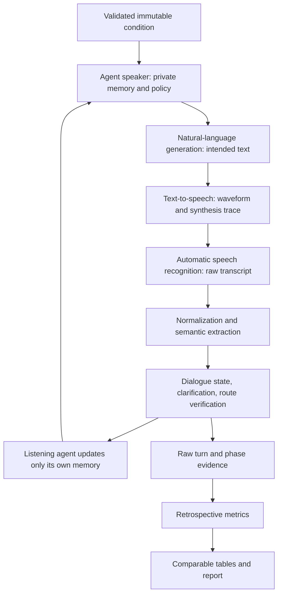
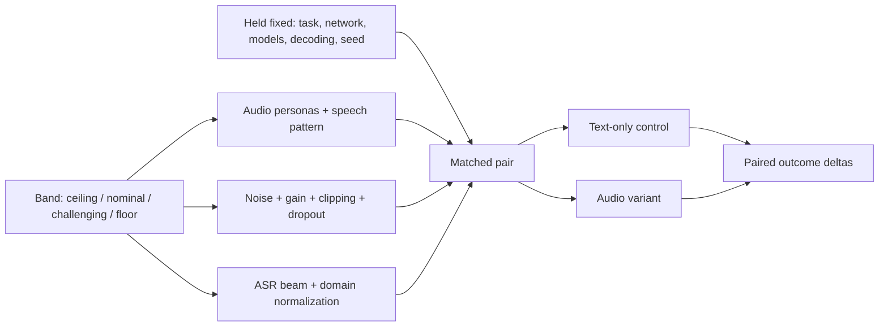
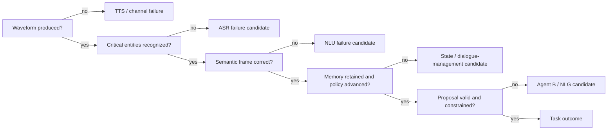
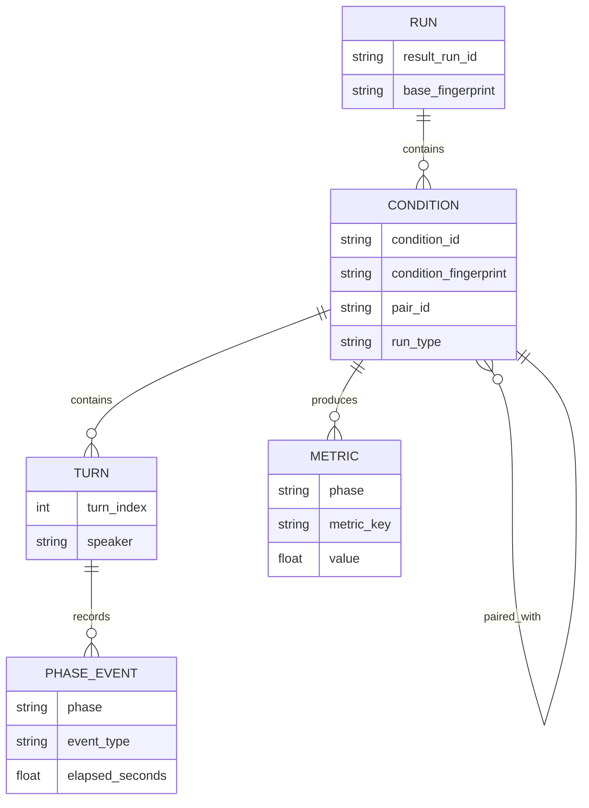

# CoopNavigationSDS

CoopNavigationSDS is a reproducible experiment framework for automatic,
phase-aware evaluation of speech dialogue systems. Agent A acts as a caller;
Agent B acts as a route-information system. They cooperate over an actual
text-to-speech (TTS) and automatic speech recognition (ASR) channel to find the
shortest valid route that satisfies progressively revealed constraints.

The framework is intended for a bachelor-thesis experiment, not general chat.
Its central contract is:

> capture immutable configuration and raw phase evidence first; compute
> derived metrics only after the dialogue; never hide provider failure or
> replace a requested backend silently.

## Contents

1. [Research design](#1-research-design)
2. [Pipeline and knowledge](#2-pipeline-and-knowledge)
3. [Route task and network](#3-route-task-and-network)
4. [Architecture and extension](#4-architecture-and-extension)
5. [Backends](#5-backends)
6. [Configuration](#6-configuration)
7. [Execution](#7-execution)
8. [Data and metrics](#8-data-and-metrics)
9. [Results](#9-results)
10. [Validation and limitations](#10-validation-and-limitations)

## 1. Research Design

One observation is one complete **condition**: scenario, personas, Agent A,
Agent B, speech pattern, TTS, ASR, decoding settings, network seed, run type,
and repetition. Turns localize failure but are not statistically independent
samples.

The design supports questions such as:

- Which pre-outcome metrics are associated with task completion and constraint
  satisfaction across Agent B model sizes?
- At which pipeline phase does an unsuccessful dialogue first deviate?
- How do TTS and ASR errors propagate into understanding, state tracking,
  policy, grounding, and task outcome?
- Which clarification and repair behavior contains speech-channel errors?
- Do larger models improve grounded cooperation enough to justify their
  latency and memory cost?

Audio treatments can be paired with deterministic text controls. The pair has
identical non-audio factors and a shared `pair_id`; `run_type` distinguishes
`audio_variant` from `text_only`. This isolates the observed speech-channel
effect. Cross-family or unmatched comparisons remain descriptive because
model family, quantization, provider, and hardware are potential confounders.

### Experimental Unit and Variables

The condition, not the turn, is the unit used for outcome comparison. A batch
may contain several conditions, and a condition may contain several turns.
Turn-level observations explain propagation and repair within one condition;
they must not be treated as independent repetitions in significance tests.

| Role | Variables | Interpretation |
| --- | --- | --- |
| Primary treatments | Agent B model/profile, speech-performance band | Intended experimental contrasts |
| Caller treatments | Agent A implementation, task persona, audio persona | User-simulation and input variation |
| Task treatments | Scenario, progressive constraints, network seed | Difficulty and route-choice variation |
| Speech treatments | TTS, ASR, waveform channel, recognition controls | Communication-channel variation |
| Controls | Prompt version, objective, turn policy, decoding, task seed | Hold fixed inside a comparison |
| Outcomes | Success, validity, constraint satisfaction, optimality, turns, latency | Final and efficiency measurements |
| Diagnostic mediators | WER, entity errors, state drift, repairs, proposal grounding | Candidate explanations of outcomes |

Model-size claims require at least two models per declared size band and enough
repetitions to separate model effects from seed variance. Speech effects should
use paired controls. Persona or scenario effects require balanced coverage;
otherwise they are reported as subgroup descriptions, not causal estimates.

### Comparison Logic


The recommended analysis order is: verify artifact integrity, inspect failures,
confirm treatment coverage, compare paired audio/text conditions, compare task
outcomes, then inspect earlier-phase metrics as possible failure indicators.
Thresholds discovered on one batch are exploratory until validated on a held-
out batch.

### Integrity Rules

- Configuration is normalized, validated, fingerprinted, then exposed as an
  immutable `ExperimentSpecification`.
- Agent A and Agent B maintain separate memories based only on their prior
  knowledge, utterances, and received ASR transcripts.
- The listener reacts to the configured ASR output, never hidden source text.
- Requested providers fail explicitly; there is no silent backend fallback.
- Batch failures are recorded per condition and do not erase or relabel data.
- Network generation is seed-controlled and rebuilt for every condition.
- Optimal routes are computed independently for each progressive constraint
  layer before dialogue evaluation.
- Raw evidence remains authoritative; metrics and HTML reports are derived.

## 2. Pipeline and Knowledge



Each turn records intended text, delivered text, audio metadata, raw ASR,
transparent normalization, extracted slots and constraints, independent agent
memory, proposed routes, verification, phase timings, and runtime diagnostics.

### Turn-Level Data Lineage

| Step | Authoritative input | Persisted output | What may consume it |
| --- | --- | --- | --- |
| Agent policy | Speaker memory and current objective | selected act and prompt audit | NLG only |
| NLG | accepted policy act and model context | intended utterance | TTS and NLG metrics |
| TTS | intended utterance and audio persona | clean waveform and synthesis trace | channel treatment and TTS metrics |
| Channel | clean waveform and registered treatment | treated waveform and realized impairment | ASR only |
| ASR | treated waveform | raw transcript and recognition timing | normalization and ASR metrics |
| NLU | raw transcript plus known station/line vocabulary | normalized transcript, slots, constraints, route parse | listener memory and NLU metrics |
| Dialogue management | listener memory and parsed frame | stage transition, repair decision, verification | next agent turn |
| Logging | outputs from every completed phase | event, protocol, timing, and metric input rows | retrospective evaluation |

The listener never receives the intended utterance or clean transcript as a
substitute for ASR. Normalization is visible and separately logged. This allows
an apparent recovery to be attributed to NLU normalization or dialogue repair
instead of incorrectly crediting ASR.

### Turn and Repair Contract

A normal turn advances one current objective. A clarification turn identifies
one unresolved critical value, and its response contains only the requested
repair where practical. Critical values are start station, destination station,
departure time, line identifiers, and active constraints. Repeated unsuccessful
repair is bounded by the configured repair/stagnation limits. Agent B does not
terminate the call; only Agent A may accept a route or close after the turn
limit. Each agent updates its private memory from what it said and what it heard,
never from the other agent's hidden state.

### Agent Prompt Contract

Prompts are role-specific and stage-aware. They are intentionally concise at
runtime to reduce inference latency and prompt dilution, while deterministic
guards enforce the experimental contract outside the language model.

**Agent A prompt responsibilities:** state start, destination, and departure
time; evaluate only what was heard; reveal at most one new private constraint
after the current stage succeeds; request a better route while retaining prior
requirements; clarify one unresolved value; and close with the best understood
proposal. Agent A is never given topology or reference optima.

**Agent B prompt responsibilities:** infer the caller's current request from its
own memory and latest understood transcript; propose a complete line-identified
route; answer the active constraint without introducing unasked constraints;
retain viable earlier proposals for comparison; clarify ambiguous critical
values; and continue assisting rather than ending the dialogue. Agent B receives
network data but not Agent A's hidden private constraints.

Prompt output is audited before delivery. Route responses must be actionable
and parseable; unsupported station/line content, repetition, excessive length,
or premature closure can trigger a recorded deterministic repair. The audit
records requested output, accepted output, intervention reason, and delivery
source, allowing guard intervention rates to be measured rather than hidden.

### Agent A Configuration and Knowledge Integrity

Agent A represents the caller. Its configurable implementation is
`template-agent-a`, `tinyllama`, or `userlm`; persona and audio persona are
separate factors. Agent A receives the registered start station, destination,
departure time, valid station names, valid line names, persona priorities, and
private constraints. It does **not** receive the topology, travel times,
fullness, delay labels, viable alternatives, or optimal route. This separation
is deliberate: Agent A must behave like a caller using the system, not like a
second route planner.

Agent A's prompt and deterministic policy enforce this sequence:

1. state start, destination, and departure time;
2. ask for transit lines to reach the destination;
3. accept a route only when it is connected, line-identified, and time-valid;
4. reveal at most one additional private constraint after the previous layer
   is satisfied;
5. request a better compliant route when the current route violates a revealed
   constraint;
6. close the call with the best route it understood, or with documented
   dissatisfaction when the turn limit is reached.

Repairs are intentionally narrow. If Agent A hears an ambiguous word or a
missing critical variable, it asks or answers only that item. A correction does
not overwrite Agent B's state silently; it becomes another spoken turn, passes
through TTS and ASR, and is visible in the protocol.

### Agent B Configuration and Knowledge Integrity

Agent B represents the route-information system. Its configurable
implementation is `simple`, `llm`, or a registered custom plugin. With the
`llm` plugin, the selected model profile and provider define the backend, while
the dialogue manager supplies the same route-network contract and prompt
contract to every model. Agent B receives network data, line names, station
names, and the route verifier, but learns Agent A's trip and constraints only
from what it hears.

Agent B's prompt and deterministic guards enforce this sequence:

1. update its own memory only from previous Agent B speech and received Agent A
   ASR/NLU output;
2. ask for exactly one missing critical fact when start, destination, or time
   is not established;
3. treat normalized equivalents as confirmed, for example `eight oh seven`,
   `8 7`, and `08:07`;
4. propose complete routes in the form `mode line from station to station`;
5. keep viable earlier proposals available for comparison;
6. adapt only to constraints Agent A has actually stated;
7. continue helping rather than ending the call.

This design makes misunderstanding loops measurable instead of hidden. If
Agent B repeats a request for information that was already understood, the
state-retention and repair metrics can identify the dialogue-management
failure. If Agent B never heard the information because of ASR, the ASR and
NLU evidence stays distinct.

### Prompt Selection Reasoning

The prompts are not optimized for fluent chat in isolation. They are optimized
for an auditable speech-dialogue experiment: short turns, explicit route
structure, controlled knowledge boundaries, and repair behavior that can be
attributed to a pipeline phase. Detailed route calculation is performed by the
network verifier, not by hidden prompt reasoning. The language models decide
how to phrase, clarify, compare, and cooperate within the current stage; the
runtime records when deterministic guards corrected or rejected an utterance.

### Agent Knowledge

Agent A initially knows the start station, destination, departure time, valid
station and line names, persona, and private constraints. It does not know the
network topology or optimal route. Agent B knows the network and line names,
but learns Agent A's trip and constraints only through received speech.

Both agents recognize the critical task variables:

- `start_station`
- `destination_station`
- `start_time_min`
- progressively revealed constraints

Clarification isolates one unresolved item. A repair is short, updates only
the listener's memory, and cannot bypass ASR evidence. Only Agent A closes the
conversation; Agent B continues trying to satisfy the active objective.

### Dialogue Stages

1. Establish a connected route from start to destination.
2. Establish acceptable duration relative to the unconstrained optimum.
3. Reveal one private constraint only after the previous layer succeeds.
4. Retain all established constraints and seek the shortest compliant route.
5. Repeat until the configured constraint limit or turn limit is reached.
6. Agent A selects the best heard viable proposal and reports satisfaction.

## 3. Route Task and Network

The deterministic synthetic network has 36 stations and metro, tram, bus, and
walking edges. Line ranges are M1-M20, T1-T25, and B1-B30; concrete generated
networks use the registered subset required by the case design. Public-
transport stations are reachable by exactly two public modes; walking joins
nearby stations and is slower than the equivalent bus movement. The
Near-capacity threshold converts recorded occupancy into the categorical
fullness condition used in dialogue.
A transfer cost is applied only when the line changes at a station.

Every complete route step identifies mode, line, origin, destination, and
duration. Consecutive segments on one line are condensed without losing
intermediate stations:

```text
tram T1 from Bravo via Charlie and Delta to Gamma
Bravo --T1 (Charlie, Delta)-> Gamma
5 min walk from Gamma to Harbor
```

A route without a line identifier is incomplete except for walking.

### Network Parameters

| Property | Representation | Reason |
| --- | --- | --- |
| Topology | Seeded graph | Reproducible case variation |
| Travel time | Line-specific segment minutes | Verifiable duration and optimum |
| Transfer time | Station-specific, line change only | Realistic interchange cost |
| Fullness | `low`, `moderate`, `high` | Robust categorical dialogue |
| Delay and missed-transfer risk | `low`, `moderate`, `high` | Avoid false numeric precision |
| Walking | Minutes between nearby stations | Persona-dependent access constraint |
| Tickets | Allowed public modes | Route feasibility constraint |

The standard case registry deliberately supplies alternatives. Each selected
case is audited for a valid route, an acceptable-time route, a changed optimum
after each progressive constraint, and the configured minimum viable
alternatives. `network_overview.json` stores all stations, lines, edges,
durations, risks, and transfer values. `network_graph.svg` renders every
connection with a separate line index.

### Objective

All new runs use `shortest_valid_route_with_constraints`. The duration gate is
`candidate_duration <= unconstrained_optimum * acceptable_duration_ratio`.
Later optima apply the cumulative spoken constraints. A replacement proposal
is better only if it remains valid, meets the duration gate, retains prior
constraints, satisfies the new constraint, and improves the selected objective.

## 4. Architecture and Extension

```text
coop_navigation_sds/
  Configuration/                 schemas, immutable resolution, GUI, jobs
  TransportNetwork/              graph, scenarios, constraints, routing
  NaturalLanguageGeneration/     agents, prompts, model adapters, plugins
  TextToSpeech/                  audio personas
  NaturalLanguageUnderstanding/  transcript and semantic interpretation
  DialogManagement/              orchestration, memory, speech transport
  EvaluationMetrics/             catalog and retrospective calculations
  ResultsAndArtifacts/           evidence, tables, comparison, coverage
  app.py                         single-run controller
  batch.py                       local batch controller
  experiments.py                 condition execution
tests/                            unit and smoke tests
jobs/                             versioned local batch designs
slurm/                            cluster array examples
scripts/                          setup, coverage, comparison, Slurm adapter
results/                          the only generated result root
```

Dependencies point from controllers toward stable contracts. Network logic
does not import model providers; metrics consume stored evidence rather than
driving dialogue; reports consume canonical tables rather than agent objects.

### Extension Contracts

- **Agent B:** register a plugin implementing `run_agent_b(state)`; keep model
  loading in its adapter, not the dialogue manager.
- **Language model:** add one `ModelProfileSpec` and provider adapter. Preflight
  must report unavailable assets or services explicitly.
- **TTS/ASR:** add one `SpeechEngineSpec` and engine implementing `synthesize`
  or `transcribe`. Preserve `SpeechSignal` diagnostics and timing.
- **Metric:** add catalog metadata, required trace fields, and one retrospective
  calculation. Return unavailable with a reason when evidence is absent.
- **Task:** add a registered scenario/test case and pass staged viability audit.

Shared defaults, schema versions, result names, and paths are centralized in
`Configuration`. Reused values must not be copied into controllers.

## 5. Backends

### Agents and Language Models

Agent A supports deterministic staged policy, TinyLlama control, and Microsoft
UserLM 8B. Agent B supports `simple`, `llm`, and custom plugin keys.

Model providers are Transformers, Ollama, llama.cpp server, and
OpenAI-compatible chat completion. Registered profiles cover meaningful
resource and family contrasts, including SmolLM2 360M/1.7B, Qwen2.5
0.5B/1.5B/7B, TinyLlama 1.1B, Gemma 2 2B, Llama 3.2 1B/3B, Phi-3 Mini,
Qwen3 4B, Mistral 7B, Falcon3 7B, Llama 3.1 8B, UserLM 8B, and a hosted API
profile. Availability depends on local assets or an explicitly configured
service.

Model-specific behavior is registry-driven. Runtime metadata records provider,
model identifier, profile, device, artifact location, and preflight status.

#### Model Comparison Design

| Dimension | Why it is varied | Required control |
| --- | --- | --- |
| Parameter scale | Tests capability/resource trade-offs | Report exact model and quantization |
| Model family | Tests architecture and instruction-tuning differences | Avoid calling family effects size effects |
| Local vs API | Tests deployment and latency profiles | Record provider, endpoint class, and timeout |
| Agent role | Separates caller simulation from route assistance | Hold the opposite agent fixed |
| Decoding | Tests determinism and response variability | Register temperature, top-p, seed, token limit |

The `simple` Agent B is a deterministic pipeline control. TinyLlama is the
small local language-model baseline. Other registered models are experimental
treatments and are loaded through the same adapter contract. Agent A's template
policy is useful for deterministic debugging; TinyLlama and UserLM provide
model-based caller conditions. A study comparing Agent B models should not mix
Agent A implementations inside one unstratified result estimate.

Model availability is operational evidence, not an outcome. Preflight records
missing assets, incompatible runtimes, unreachable endpoints, and resource
errors. The requested model is never silently replaced with a smaller model or
the deterministic agent because that would invalidate the condition label.

#### Agent B Model Proposal Catalog

The main thesis matrix uses two canonical Agent B models per size tier so the
experiment remains tractable. Additional registered candidates are documented
for follow-up batches or replacement when a cluster cannot run one canonical
condition. Each proposal has a distinct experimental reason; models are not
added merely because they are available.

| Tier | Slot | Model | Provider | Unique aspect | Best use |
| --- | --- | --- | --- | --- | --- |
| Small | small1 | `llama3.2:1b` | Ollama | canonical small Llama-family chat baseline | low-resource local baseline |
| Small | small2 | `qwen2.5:1.5b` | Ollama | larger multilingual Qwen-family small model | tests modest scale and family shift |
| Small | small3 | `HuggingFaceTB/SmolLM2-360M-Instruct` | Transformers | sub-billion model with very low memory | floor condition and smoke tests |
| Small | small4 | `Qwen/Qwen2.5-0.5B-Instruct` | Transformers | very small multilingual model without Ollama | provider/runtime contrast |
| Medium | medium1 | `llama3.2:3b` | Ollama | canonical medium Llama-family model | middle resource point |
| Medium | medium2 | `phi3:mini` | Ollama | non-Llama Phi architecture with compact reasoning focus | repair and clarification contrast |
| Medium | medium3 | `gemma2:2b` | Ollama | Gemma-family model with lower memory than Phi | architecture contrast at moderate cost |
| Medium | medium4 | `qwen3:4b` | Ollama | newer Qwen generation | constraint handling and multilingual contrast |
| Large | large1 | `llama3.1:8b` | Ollama | canonical large Llama-family baseline | high-quality local baseline |
| Large | large2 | `qwen2.5:7b` | Ollama | large multilingual Qwen comparison | cross-family large-model contrast |
| Large | large3 | `mistral:7b` | Ollama | Mistral-family instruction model | non-Llama/Qwen repair behavior |
| Large | large4 | `tiiuae/Falcon3-7B-Instruct` | Transformers | Falcon-family assistant model with multilingual support | replaces UserLM as large Agent B proposal |

The non-Ollama Transformers Agent B grid contains twelve registered proposals
across the same size tiers. It is intended for clusters where Ollama cannot be
installed or kept reachable, and it is also useful as a provider contrast when
Ollama is available. The grid exists for both Agent A callers:

- `transformers_speech_grid/` uses TinyLlama as Agent A for lower memory
  baseline coverage.
- `userlm_transformers_speech_grid/` uses Microsoft UserLM as Agent A for the
  stronger caller condition.

UserLM plus a second large model can require high-memory CPU nodes or a
compatible accelerator. Such resource failures are operational evidence and
are recorded as condition failures; they are not silently replaced by smaller
models.

```bash
python scripts/setup_transformers_agent_b_models.py --cluster-safe --download
python scripts/setup_transformers_agent_b_models.py --cluster-safe --json

# Optional exhaustive preparation. Use this only when all listed models are
# authorized and the cluster can tolerate the download/runtime footprint.
python scripts/setup_transformers_agent_b_models.py --tier small --tier medium --tier large --download

python scripts/run_agent_b_llm_batch.py \
  --batch jobs/agent_b_llm/batches/07-transformers-agent-b-all.json \
  --results-dir results \
  --preview
```

Model setup commands show a dependency-free progress bar in interactive
terminals while keeping JSON output machine-readable. Use `--no-progress` for
plain Slurm logs or scripted checks:

```bash
python scripts/setup_agent_b_models.py --tier small --pull
python scripts/setup_transformers_agent_b_models.py --tier small --download
python scripts/prepare_test_environment.py
python scripts/prepare_test_environment.py --check --no-progress
```

Transformers readiness requires a local config file, tokenizer assets, and at
least one model-weight file or shard. This deliberately rejects partial Hugging
Face snapshots that contain only metadata; starting a Slurm array with such a
folder would fail later during model loading and would corrupt coverage
interpretation.

`jobs/agent_b_llm/batches/08-transformers-agent-b-small-medium.json` is the
recommended first cluster manifest because it covers eight non-Ollama Agent B
models without the 7B/8B memory burden.

### TTS

| Engine | Experimental value |
| --- | --- |
| Piper | Fast, local neural baseline |
| eSpeak NG | Lightweight parametric cross-platform baseline |
| ChatTTS | Conversational neural synthesis and speaker sampling |
| Windows SAPI | Native Windows reference condition |

Piper is the default cross-platform neural TTS baseline because it is local,
fast, and reproducible with a pinned voice file. eSpeak NG supplies a low-cost
parametric contrast. ChatTTS provides a conversational neural-family contrast
with a larger dependency and memory footprint. SAPI is retained for
Windows-specific reference runs and must not be pooled with cross-platform
conditions without explicitly modeling operating system and voice differences.

### ASR

| Engine | Experimental value |
| --- | --- |
| Faster-Whisper | Accurate configurable neural baseline |
| Vosk | Small, low-latency CPU baseline |
| whisper.cpp | Portable quantized Whisper runtime |
| sherpa-onnx | Portable ONNX runtime and architecture contrast |
| Qwen3-ASR | Larger multilingual neural condition |
| Windows SAPI | Native Windows reference condition |

Vosk is the small CPU recognition baseline; Faster-Whisper is the stronger
configurable neural baseline. whisper.cpp tests a portable native deployment,
and sherpa-onnx tests an ONNX deployment. Qwen3-ASR is a larger model treatment.
SAPI remains an operating-system-specific reference. Beam/search width is
recorded because it can change recognition accuracy and latency and therefore
cannot be treated as an invisible implementation detail.

`file` TTS and ASR are internal deterministic controls. File TTS writes a tone
WAV plus transcript sidecar; file ASR reads that sidecar. They must be used
together for text controls and smoke tests and are not valid speech-quality
providers.

Audio personas are independent of engines. A persona resolves speech rate,
pauses, pitch, volume, hesitation, fillers, stutter, clipping, substitutions,
and noise/error intensity. The resolved values, not only the persona name, are
stored with the condition.

### Controlled Speech-Performance Range

The shared `speech_performance_bands` job field expands a model combination
into four **linked treatments**. A linked treatment changes the caller and
operator audio personas, utterance pattern, physical waveform channel, ASR
search, and normalization together. Task, network, model, decoding, and seed
remain fixed. This is a stress-test axis, not a factorial estimate of each
individual audio parameter.

| Band | Audio personas | Utterance / ASR | Waveform channel | Expected role |
| --- | --- | --- | --- | --- |
| Ceiling | High-clarity caller and operator | Clean, beam 16, normalization 0.80 | Unity gain; no added impairment | Upper performance bound |
| Nominal | Neutral caller, clear operator | Mostly clean, beam 11, normalization 0.86 | 30 dB SNR, -2 dB gain, 0.5% dropout | Normal operating condition |
| Challenging | Degraded caller and operator | Hesitant, beam 6, normalization 0.92 | 15 dB SNR, -6 dB gain, 0.70 clip, 4% dropout | Recoverable communication stress |
| Floor | Barely understandable caller and operator | Severe channel, beam 1, normalization off | 5 dB SNR, -12 dB gain, 0.35 clip, 15% dropout | Expected failure bound |

SNR is signal-to-noise ratio; lower is noisier. Dropout removes deterministic
20 ms waveform blocks. Clipping, gain, noise, and dropout are applied to the
actual TTS waveform before ASR, with configured and realized values logged.
The clean synthesized waveform is retained in the trace while the treated
waveform is the authoritative ASR input. Text controls record the treatment
but bypass waveform processing.



The settings are declared before execution and are never retained or changed
because of observed outcomes. A complete model treatment requires all four
bands. Preflight rejects incomplete sets. `performance_band_summary.csv`
reports completeness, ordered outcomes, a documented 0.02 score tolerance,
and ceiling-minus-floor gaps. Monotonicity is a diagnostic, not a criterion
for deleting or relabelling observations.

## 6. Configuration

Precedence is explicit:

```text
central defaults < saved GUI settings < job config < grid/profile values < CLI
```

The final mapping is normalized once, credentials are excluded from persisted
artifacts, and two SHA-256 identities are recorded: one for the shared immutable
batch specification and one for that specification plus the complete condition.
Runtime code receives the immutable specification.

Configuration groups follow execution order:

1. network, scenario, and constraints
2. Agent A and caller persona
3. Agent B plugin, model, and decoding
4. audio personas and TTS
5. ASR and transcript normalization
6. dialogue limits and repair policy
7. logging, results, pairing, and batch design

The optional GUI displays these groups but is not required. Scripted and batch
execution are first-class and use the same validator. Implementation-specific
controls appear only for the selected backend. Operational choices are
determined by preflight; unavailable choices remain explicit in configuration
diagnostics rather than failing later without context.

The authoritative defaults are returned by `app.default_run_config()`. The
authoritative job schema is implemented in `Configuration/jobs.py`; example
documents are under `jobs/`. This avoids a manually duplicated setting list in
documentation. Use `python -m coop_navigation_sds.batch --help` for current
CLI overrides.

### High-Impact Configuration Reference

| Setting | Function | Integrity requirement |
| --- | --- | --- |
| `test_case_key` | Selects scenario, start, destination, time, constraints | Must pass staged viability audit |
| `persona_key` | Selects Agent A task behavior and priorities | Keep balanced across model comparisons |
| `agent_a_type` | Template, TinyLlama, or UserLM caller | Record exact model when model-based |
| `agent_b_plugin` | Deterministic, LLM, or custom assistant | Plugin must expose the standard state contract |
| `model_profile` / `model_name` | Resolves provider and model assets | No silent profile substitution |
| `model_param_key` | Selects registered decoding values | Persist resolved values, not only key |
| `num_turns` | Hard dialogue-turn budget | Same within direct comparisons |
| `maximum_progressive_constraints` | Number of staged private constraints | Cannot exceed case viability layers |
| `minimum_compared_routes` | Required alternatives before informed choice | Route identities must be distinct |
| `tts_engine` / `asr_engine` | Speech providers | Must pass platform and asset preflight |
| `speech_performance_bands` | Linked floor-to-ceiling treatments | Use complete four-band sets |
| `paired_audio_text_runs` | Adds matched text-only controls | Pair retains all non-audio factors |
| `network_seed` / `experiment_seed` | Reproduces task and stochastic behavior | Vary deliberately across repetitions |
| `log_profile` | Controls diagnostic verbosity | Batch research runs use `full` |

Implementation-specific settings remain under their owning phase. For example,
ASR beam size belongs to ASR, while speaking rate belongs to the audio persona
and provider-specific synthesis controls belong to TTS. This prevents one
generic "quality" setting from obscuring which pipeline phase was changed.

### Job Anatomy and Expansion

```json
{
  "schema_version": 1,
  "name": "tinyllama_speech_performance_range",
  "iterations": 1,
  "coverage_strategy": "full_factorial",
  "config": {
    "agent_a_type": "tinyllama",
    "agent_b_plugin": "llm",
    "paired_audio_text_runs": true
  },
  "grid": {
    "test_cases": ["morning_peak_cross_city"],
    "personas": ["focused_commuter"],
    "tts_engines": ["piper"],
    "asr_engines": ["vosk"]
  },
  "speech_performance_bands": [
    "ceiling", "nominal", "challenging", "floor"
  ],
  "parameter_values": {"network_seed": [42]}
}
```

- `config` contains factors fixed for the entire job.
- `grid` contains independent categorical factors.
- `parameter_values` contains numeric or implementation-level factors.
- `linked_profiles` changes correlated values as one registered treatment.
- `coverage_strategy=full_factorial` enumerates every factor combination.
- `coverage_strategy=pairwise` reduces combinations and must not be used where
  every level of a preregistered treatment is required per model group.
- `iterations` creates explicit repetitions; it does not duplicate rows after
  execution.

Small smoke-style jobs may expand to `4 bands x 2 run types x 1 repetition =
8` conditions. Thesis grids use pairwise coverage across scenarios, personas,
audio personas, speech patterns, decoding, ASR search width, repair limits,
seeds, and provider choices. Expansion is deterministic in both cases. Every
condition receives a readable code, full condition record, pair identifier
where applicable, base fingerprint, and condition fingerprint before model
execution.

### Optional Configuration GUI

The GUI is a configuration/debug surface, not part of dialogue execution. It
groups settings by pipeline phase, shows implementation-specific controls only
for the selected backend, previews network and staged optimal routes, lists data
and metric dependencies, and displays preflight warnings before launch. Closing
the GUI without starting creates no result. Batch and Slurm runs bypass Tk and
use exactly the same normalization and validation functions, which keeps Linux
headless execution first-class.

GUI values are saved in a scriptable settings document and reloaded on the next
interactive start. Job or CLI values override saved GUI values according to the
precedence rule above. The GUI must therefore be treated as one configuration
editor, not as a second runtime implementation.

## 7. Execution

### Setup and Preflight

```powershell
python -m venv .venv
.venv\Scripts\Activate.ps1
pip install -r requirements.txt
python scripts/prepare_test_environment.py --check
```

```bash
python3 -m venv .venv
source .venv/bin/activate
python -m pip install -r requirements.txt
python -m pip install -r requirements-speech-optional.txt
python scripts/setup_speech_providers.py
python scripts/prepare_test_environment.py --check
```

The project speech runtime supports Python 3.11 through 3.14, including Python
3.13 supplied by Debian 13. Provider setup validates capabilities and installed
packages; it does not require one exact main-runtime minor version.

Optional providers use isolated environments and local model directories.
Preparation may download requested assets; experiment runtime does not replace
or download an unrequested model. Exact requirements are listed in
`requirements-speech-optional.txt` and checked before execution.

Preflight follows a fixed order:

1. normalize and validate the requested configuration;
2. resolve operating-system-compatible providers and explicit asset paths;
3. verify model/provider dependencies without changing the condition;
4. audit scenario connectivity and every progressive constraint layer;
5. expand and validate job coverage, pairing, and treatment completeness;
6. fingerprint the shared specification and each condition;
7. create the unique result directory and begin runtime logging.

Provider probes distinguish **contract readiness** from **live readiness**.
Contract tests construct every adapter pair with deterministic test signals and
do not import heavy model providers. A live matrix, when explicitly requested,
checks each engine once and then runs viable pairings. This avoids treating a
slow repeated import as evidence about dialogue performance.

### Smoke Test

```bash
python -m coop_navigation_sds --smoke --results-dir results
```

This uses deterministic Agent B and file/file transport, requires no model
download, and validates configuration, routing, dialogue, evidence capture,
retrospective metrics, and result export.

### Interactive Run

```bash
python -m coop_navigation_sds
```

The configuration GUI is optional and cross-platform through Tk. Closing it
without starting does not create an experiment result.

### Batch Run

```bash
python -m coop_navigation_sds.batch \
  --job-file jobs/support/small_agent_b_speech_grid.job \
  --results-dir results --progress
```

Jobs declare fixed `config`, independent `grid` factors, linked profiles,
parameter values, coverage strategy, and repetitions. Paired controls double
audio conditions with matching text controls. Preview expansion before model
loading with the helper documented by the job or the Slurm condition preview.

Each condition is isolated. A condition-level model, TTS, ASR, or dialogue
failure is written to `condition_failures.jsonl`; the next condition continues.
Storage or schema failure is process-fatal because continuing could produce an
unauditable dataset.

Condition failures therefore produce analyzable rows rather than terminating a
thesis-scale batch. Examples are unavailable model assets, provider timeout,
unusable waveform, ASR exception, and dialogue runtime failure. Corrupt result
storage, schema mismatch, or inability to preserve evidence remains fail-fast.
This boundary keeps experimental failures observable while preventing partial
or mislabeled datasets from being accepted.

The compact TinyLlama range baseline is:

```powershell
.venv\Scripts\python.exe -m coop_navigation_sds.batch `
  --job-file jobs\support\small_agent_b_speech_grid.job `
  --results-dir results --progress
```

```bash
.venv/bin/python -m coop_navigation_sds.batch \
  --job-file jobs/support/small_agent_b_speech_grid.job \
  --results-dir results --progress
```

The current support job uses pairwise coverage and creates 84 conditions per
Agent A/Agent B model pairing. The factors cover four scenarios, four task
personas, four caller audio personas, four operator audio personas, four speech
patterns, three decoding profiles, two ASR engines, two network seeds, four
ASR beam widths, two stagnation limits, and two transfer-tolerance values while
preserving paired audio/text controls. One condition per factor pair is enough
to expose a broad success-to-failure spectrum for pipeline debugging; thesis
inference still requires preregistered repetitions or held-out batches. The
same profile registry is reusable for every Agent A/Agent B model combination
without copying parameter values into model-specific jobs.

### Slurm

```bash
python scripts/run_slurm_condition.py --grid slurm/minillama_grid.json --preview
sbatch --array=0-N%K slurm/minillama_grid_cpu.sbatch
```

Each array index maps deterministically to one exported condition JSON and a
unique result directory. Local preview and tests do not require Slurm.

For local debugging, run one condition sequentially before increasing process
count. For cluster execution, choose `%K` from measured memory use rather than
CPU count alone because language models and speech providers can dominate RAM
or GPU memory. Array tasks must use a shared immutable grid file but separate
result directories. Aggregation runs only after all tasks have stopped.
Slurm standard output and error files are written under `slurm/logs/` so
scheduler diagnostics are transportable through Git without filling the project
root.

The recommended thesis-scale Slurm path is the independent Agent B model
submitter. It discovers every registered job file for the requested caller
family and size tier, computes the condition count, and submits independent
Slurm arrays per Agent B model. This prevents one unavailable model, endpoint,
or node class from blocking the rest of the experiment.

```bash
python scripts/submit_agent_b_model_jobs.py --root jobs/agent_b_llm/userlm_transformers_speech_grid --provider transformers --tier small --max-conditions-per-array 14 --dry-run
python scripts/submit_agent_b_model_jobs.py --root jobs/agent_b_llm/userlm_transformers_speech_grid --provider transformers --tier small --array-concurrency 1 --max-conditions-per-array 14
python scripts/submit_agent_b_model_jobs.py --root jobs/agent_b_llm/userlm_transformers_speech_grid --provider transformers --tier medium --array-concurrency 1 --max-conditions-per-array 14
python scripts/submit_agent_b_model_jobs.py --root jobs/agent_b_llm/userlm_transformers_speech_grid --provider transformers --tier large --array-concurrency 1 --max-conditions-per-array 14
```

The recommended cluster path uses only
`jobs/agent_b_llm/userlm_transformers_speech_grid` and `--provider
transformers`, which avoids Ollama service failures while preserving the same
non-model condition coverage. The default cluster helper selects six
service-free Transformer profiles: two small, two medium, and two large. This
is the recommended first thesis-scale run because it gives exactly two
comparisons in every model-size tier without requiring Ollama or known gated
profiles. Each selected model has 84 conditions. The cluster helper limits each
submitted array to 14 condition indices by default, so each model becomes six
smaller arrays: `0-13`, `14-27`, `28-41`, `42-55`, `56-69`, and `70-83`.
Every array task still executes one condition, and every chunk keeps the same
CPU, memory, and 3:59:00 per-task time-limit request; only the number of
condition indices per submitted Slurm job changes. Override
`MODEL_PROFILES` when a site has additional authorized local models and the
larger coverage is desired. The configured factors intentionally span ceiling,
nominal, challenging, and floor speech performance so successful and
unsuccessful dialogues can be compared phase-wise.

The submitter writes Slurm stdout and stderr under `slurm/logs/`, uses unique
job-name suffixes, and passes `RESULTS_ROOT` to the batch runner so every
condition writes to the single `results/` root. Ollama-backed jobs start a
per-task local Ollama service on a task-specific port. Transformers jobs do not
require Ollama but must pass model-asset preflight.

All UserLM Agent B Slurm jobs share the same non-model condition design. The
only intended treatment change is Agent B model identity and its required
runtime provider/profile. Scenario, persona, caller and operator audio persona,
speech pattern, TTS, ASR, ASR beam width, network seed, repair limits, transfer
tolerance, text/audio pairing, and objective are held constant. The analysis
layer records a `model_comparison_condition_key` that ignores model-only fields
and joins identical condition cells across models.

Slurm resource requests are computed from registered model memory estimates:
UserLM caller memory plus Agent B model memory plus speech/runtime overhead,
rounded upward to a scheduler-friendly value. For UserLM/Transformers jobs the
submitter uses 6 CPUs for small, 8 CPUs for medium, and 10 CPUs for large
models, with per-model memory requests such as 48-52G for small, 52-56G for
medium, and about 72G for the current large cluster-safe models. All UserLM
Transformer tiers default to 3:59:00 per condition because previous evidence
showed long NLG turns in otherwise valid runs. This avoids using one excessive
memory request for every model in a size tier while giving each isolated
condition enough wall time to finish.

The independent Agent B arrays are CPU-first. `agent_b_model_cpu_array.sbatch`
exports CPU-only CUDA guards and passes CPU devices for Agent A, Agent B, TTS,
and ASR. The Transformers loader repeats that guard before tokenizer/model
loading, so CPU submissions do not fail when Slurm places them on a node that
exposes an old or incompatible NVIDIA driver. GPU use is intentionally separate:
request it only with a dedicated GPU wrapper and a compatible PyTorch/driver
stack.

Single-condition Slurm array tasks do not rebuild the shared coverage registry
while running. This prevents concurrent writes to root-level coverage CSV/HTML
files. Setup and preflight errors remain fail-fast because a missing model,
invalid speech asset, or corrupt environment cannot produce a valid condition.
Once a condition starts, dialogue, TTS, ASR, model-response, and task failures
are captured as experimental evidence and finalized into the standard result
files. This keeps failed conversations analyzable instead of losing them as
empty Slurm failures.
Speech performance-band completeness is written to `coverage_plan.json`.
Incomplete per-treatment band coverage and incomplete pairwise factor-pair
coverage are warnings for Slurm grids, not runtime blockers, because each array
task executes one condition and the analysis layer handles missing bands and
missing factor pairs explicitly. The Slurm wrapper therefore passes
`--no-require-complete-speech-performance-coverage`; otherwise sharded arrays
can stop at preflight with only a coverage warning and no condition execution.
After an array or group of arrays completes, refresh the comparable coverage
and result-analysis documents once:

```bash
python3 scripts/update_experiment_coverage.py --results-dir results
python3 -m coop_navigation_sds.ResultsAndArtifacts.comparison results --output results/comparison
```

Override paths without editing job files when needed:

```bash
PROJECT_ROOT=/path/to/CoopNavigationSDS \
PYTHON_BIN=/path/to/CoopNavigationSDS/.venv-linux/bin/python \
RESULTS_ROOT=/path/to/CoopNavigationSDS/results \
python scripts/submit_agent_b_model_jobs.py --root jobs/agent_b_llm/userlm_transformers_speech_grid --provider transformers --tier small --dry-run
```

Legacy single-model wrappers remain available for focused retries:

```bash
sbatch slurm/userlm_small1_cpu_array.sbatch
sbatch slurm/userlm_small2_cpu_array.sbatch
sbatch slurm/userlm_large2_cpu_array.sbatch
```

The non-Ollama Transformers Agent B matrix can also be submitted through the
older tier-specific wrappers. Submit small and medium first to get a useful
success/failure spectrum with lower scheduler friction; submit large only when
high-memory CPU nodes are available:

```bash
scripts/submit_transformers_agent_b_arrays.sh --small-medium

JOB_FILE=jobs/agent_b_llm/transformers_speech_grid/large/04-falcon3-7b.job \
sbatch slurm/transformers_agent_b_large_cpu_array.sbatch
```

Debian 13 cluster pull and full UserLM coverage:

```bash
cd /beegfs/home/users/g/generalgroovy/experiments/CoopNavigationSDS
eval "$(ssh-agent -s)"
ssh-add /beegfs/home/users/g/generalgroovy/experiments/CoopNavigationSDS/key2
GIT_SSH_COMMAND="ssh -i /beegfs/home/users/g/generalgroovy/experiments/CoopNavigationSDS/key2 -o IdentitiesOnly=yes -o HostName=ssh.github.com -o Port=443" \
  git pull --ff-only origin main
source .venv-linux/bin/activate
scripts/cluster_userlm_agent_b_full_coverage.sh prepare
scripts/cluster_userlm_agent_b_full_coverage.sh preview-small
scripts/cluster_userlm_agent_b_full_coverage.sh submit-small
scripts/cluster_userlm_agent_b_full_coverage.sh preview-medium
scripts/cluster_userlm_agent_b_full_coverage.sh submit-medium
scripts/cluster_userlm_agent_b_full_coverage.sh preview-large
scripts/cluster_userlm_agent_b_full_coverage.sh submit-large
```

The cluster helper is intentionally fail-fast during environment preparation
and Slurm submission. `prepare` verifies the Python environment, downloads or
checks only the speech-provider assets required by the selected non-Ollama
grid, prepares UserLM as Agent A, prepares the selected Transformer Agent B
profiles, and writes the readiness manifest. The actual condition arrays then
capture condition-level pipeline failures as result data. The default speech
assets are `piper faster_whisper`; override `SPEECH_ASSETS` only when the job
grid actually uses additional speech providers. The default
`MODEL_PROFILES` are:

| Size | Profiles |
| --- | --- |
| Small | `tinyllama_1b_transformers`, `qwen2_5_0_5b_transformers` |
| Medium | `qwen2_5_1_5b_transformers`, `phi3_mini_4k_transformers` |
| Large | `qwen2_5_7b_transformers`, `falcon3_7b_transformers` |

Transformer model assets are prepared separately through
`setup_transformers_agent_b_models.py`, so language models are not duplicated
under `.speech-providers`. `preview`, `preview-small`, `preview-medium`, and
`preview-large`
print the exact model-size-sorted and chunked Slurm arrays without calling `sbatch`.
`submit`, `submit-small`, `submit-medium`, and `submit-large` send one
set of chunked arrays per Agent B model with the same condition grid and only
the Agent B model changed. `MAX_CONDITIONS_PER_ARRAY` defaults to `14`, which
keeps each submitted array small enough to recover partial progress while
avoiding excessive scheduler-job counts. `ARRAY_CHUNKS` remains available for
manual fixed chunking, but the maximum-condition setting is preferred. `refresh`
should be run after jobs finish to rebuild coverage and comparison artifacts:

```bash
scripts/cluster_userlm_agent_b_full_coverage.sh refresh
```

To refresh, stage, commit, and push result/log evidence from the Debian cluster
in one reproducible step:

```bash
scripts/cluster_userlm_agent_b_full_coverage.sh push-results
```

The helper defaults to
`jobs/agent_b_llm/userlm_transformers_speech_grid`, which avoids the Ollama
daemon on clusters where it cannot be installed. Set `INCLUDE_OLLAMA=1` only on
systems where `ollama` is available and serving is permitted; otherwise the
script fails before submission instead of creating invalid runs. Useful
overrides are `PYTHON_BIN`, `RESULTS_ROOT`, `MODEL_ROOT`,
`ARRAY_CONCURRENCY`, `MAX_CONDITIONS_PER_ARRAY`, `ARRAY_CHUNKS`,
`SPEECH_ASSETS`, `MODEL_PROFILES`, `HF_MAX_WORKERS`, `ASSET_TIMEOUT_SECONDS`, and
`MODEL_DOWNLOAD_TIMEOUT_SECONDS`. The model-download timeout is an external
cluster safety guard around Hugging Face preparation; if a transfer stalls, the
prepare step exits nonzero instead of leaving a silent terminal.

If a cluster rejects the large tier because of memory, time, or partition
limits, keep the completed small and medium jobs and submit large models one at
a time with the partition-specific limits accepted by that site. Do not lower
model size inside the job; that would change the condition.

## 8. Data and Metrics

Raw evidence is captured during execution; all registered metrics are computed
after conversation completion. Missing evidence yields an unavailable metric
with a reason, never a fabricated zero.

| Phase | Principal evidence |
| --- | --- |
| User simulation | goals, private constraints, reveal order, acceptance |
| Audio/turn taking | waveform, duration, overlap, endpoint timing |
| ASR | intended/spoken/raw text, token alignment, route entities |
| NLU | normalized text, intents, slots, constraints, semantic frames |
| State tracking | separate memories, additions, retained constraints |
| Dialogue management | stage transitions, clarification, repair, policy |
| Agent B execution | proposals, route parsing, grounding, validation |
| NLG | intended utterance, executable route language, faithfulness |
| TTS | waveform, synthesis metadata, reference availability |
| Task outcome | validity, duration, constraints, optimum gap, satisfaction |
| Whole dialogue | turns, latency, cost, trajectory, failure location |
| Cross-run validity | variance, rank stability, missingness, correlations |

### Metric Calculation Contract

Every exported metric has a phase, definition, direction, expected range,
required evidence, formula, concrete operands, substituted calculation, value,
and unavailable reason. The calculator reads persisted evidence after dialogue
completion. It does not call agents or reconstruct missing turns from summary
text. This makes metric recalculation deterministic and permits correction of a
metric formula without rerunning the expensive conversation.

```text
word_error_rate
  reference = intended TTS text tokens
  hypothesis = raw ASR transcript tokens
  numerator = substitutions + deletions + insertions
  denominator = reference token count
  value = numerator / denominator
  direction = lower is better
  range = 0 to unbounded (normally reported near 0 to 1)
```

Task success is deliberately stricter than a fluent closing utterance. It
requires a valid route, destination reachability, acceptable duration, and all
revealed constraints satisfied. Constraint satisfaction is zero when the route
is invalid or does not reach the destination; this prevents vacuous credit.

| Metric group | Typical question | Important limitation |
| --- | --- | --- |
| ASR errors | Did audio preserve words and route entities? | WER weights all tokens equally |
| NLU accuracy | Were intents, slots, constraints, and routes extracted? | Requires reference semantic frames |
| State tracking | Did each agent retain what it legitimately learned? | Agreement is not correctness |
| Repair | Did clarification isolate and resolve the fault? | A repair can succeed after costly extra turns |
| Proposal quality | Was Agent B's route grounded and actionable? | Depends on route parser coverage |
| Task outcome | Was the shortest acceptable constrained route selected? | Synthetic task validity bounds generalization |
| Audio quality | Is synthesized/treated speech perceptually usable? | Some measures need licensed models or references |
| Metric validity | Does a metric track outcomes across conditions? | Needs enough independent conditions and outcomes |

Unavailable values are not zero. A missing reference waveform makes a
reference-based audio metric unavailable; it does not mean poor audio quality.
Likewise, cross-run correlations and variance remain unavailable when the batch
does not contain enough independent observations.

Channel treatment and outcome are kept separate. ASR metrics use intended TTS
speech and the raw recognized transcript; NLU metrics use the transparent
normalized transcript; task metrics require a valid route that reaches the
destination. Consequently, an invalid route cannot receive constraint-
satisfaction credit even when no individual constraint violation was parsed.

`metric_inputs.json` is the replayable raw metric input. `metrics_long.csv` is
the canonical metric table: one condition/metric row with value, phase, range,
direction, evidence class, formula, operands, substitution, and unavailable
reason. `metrics_wide.csv` is a convenience table for statistical packages.
The XLSX workbook is a human-readable view, not the canonical source.

### Failure Localization

The earliest failed or degraded phase is inferred from chronological evidence,
not from final success alone:



These labels are diagnostic candidates. Error propagation can produce several
downstream metric changes from one upstream fault, so downstream symptoms must
not be counted as independent root causes.

Metric definitions, exact calculations, ranges, required fields, capture time,
interpretation, and limitations are in [METRIC_REFERENCE.md](METRIC_REFERENCE.md).
Generated API details are in [API_REFERENCE.md](API_REFERENCE.md).

## 9. Results

`results/` is the only result root. Every run has a unique folder. Model-group
folders may organize batches, but each completed run remains self-contained.

### Canonical Run Contract

| Artifact | Function |
| --- | --- |
| `run_summary.json` | concise entry point, counts, key tables, manifest links |
| `artifact_inventory.json` | role, canonical status, size, and SHA-256 per file |
| `experiment_manifest.json` or `run_manifest.json` | immutable configuration and environment |
| `conditions.jsonl` | one comparable row per condition |
| `conversation_protocols.jsonl` | combined structured dialogue evidence |
| `conversation_transcripts.txt` | combined readable transcript |
| `*_conversation.wav` | one verified waveform per condition |
| `metric_inputs.json` | evidence sufficient for retrospective recalculation |
| `metrics_long.csv` | canonical graphable metric facts and calculations |
| `metrics_wide.csv` | condition-level modeling convenience table |
| `network_overview.json`, `network_graph.svg` | exact task environment |
| `runtime_events.jsonl`, `runtime.log` | chronological diagnostics |
| `analysis_overview.html` | derived run-level inspection view |

The inventory distinguishes irreplaceable evidence from regenerable analysis
and hashes every listed artifact. A completed run requires `run_summary.json`.
An interrupted folder remains diagnostic evidence and is not counted as a
completed observation.

Per-turn text and audio fragments are consolidated only after record counts,
line ranges, source paths, and WAV assembly are verified. Audio from different
conditions is never merged. Existing raw evidence is not rewritten during
analysis regeneration.

### Result Data Relationships



`condition_id` is the stable join key across condition, transcript, event, and
metric exports. `pair_id` joins the text-only and audio variant of the same
non-audio condition. `result_run_id` identifies the execution folder. The base
fingerprint proves the shared batch specification; the condition fingerprint
also includes every expanded factor and run type.

### Current TinyLlama Range Baseline

The clean sequential rerun `20260705_040518_b-n0008` completed all eight
conditions with Piper and Vosk. These values demonstrate treatment separation;
they are not inferential results because each band has one repetition.

| Audio band | Task success | Valid route | Constraint satisfaction | Evaluation score | ASR word error rate |
| --- | ---: | ---: | ---: | ---: | ---: |
| Ceiling | 1 | 1 | 1.0000 | 0.9536 | 0.2315 |
| Nominal | 1 | 1 | 1.0000 | 0.9546 | 0.2217 |
| Challenging | 1 | 1 | 1.0000 | 0.9092 | 0.2682 |
| Floor | 0 | 0 | 0.0000 | 0.0662 | 0.7349 |

The ceiling-minus-floor task-success gap is `1.0`; the evaluation-score gap
is `0.8874`. The ordering passes the registered 0.02 tolerance. Raw evidence,
operands, paired controls, and calculation substitutions remain in the run
folder, so this summary can be regenerated rather than trusted as a separate
source of truth.

### Cross-Run Comparison

```bash
python -m coop_navigation_sds.ResultsAndArtifacts.comparison \
  results --output results/comparison
```

The canonical comparison output contains joined conditions, joined long
metrics, metric summaries, paired deltas, robust outliers, a condition analysis
table, `run_phase_metric_matrix.html`, and `phase_metrics/*.csv`. The matrix
places completed runs in rows and phase-ordered metrics in columns. The
phase-specific CSV files place each calculable metric beside the matching run,
condition, task outcome, route validity, constraint satisfaction, TTS, ASR,
scenario, and persona, so phase failures can be compared without reopening each
run folder. Color encodes outcome and descriptive outlier status; it does not
establish causality or a validated threshold.
Positive-direction metrics use greener cells for larger normalized values;
negative-direction metrics use greener cells for smaller normalized values.
Unavailable metrics remain neutral with the unavailable reason in the derived
tables. Raw result files are not modified during comparison generation.

Interrupted and preflight-only runs use a separate evidence-preserving view:

```bash
python -m coop_navigation_sds.ResultsAndArtifacts.comparison \
  results --output results/analysis --include-partial
```

`comparison_overview.html` links normalized evidence and aggregate views: run
lifecycle, configuration groups, task outcomes, task success by configuration,
model-by-configuration matrix, Agent B model summary, phase metrics, phase
summary by model, dialogue state, dialogue summary, and conversation turns.
`analysis_guide.md` explains how to use each file. Every planned condition is
represented as `completed`,
`interrupted`, or
`not_started`. Missing outcomes remain blank and are never converted to failure
or zero. `analysis_manifest.json` hashes source evidence before and after
generation and aborts if any source file changes. The command writes only
derived files beneath `results/analysis`.

`model_configuration_matrix.csv` and `model_configuration_matrix.html` are the
primary Slurm comparison views. Each row is one non-model condition:
scenario, persona, audio personas, speech pattern, TTS, ASR, beam width, seed,
run type, and repair settings. Each Agent B model becomes a column with task
success, route validity, constraint satisfaction, word error rate, turn count,
failure phase, and source run. Green/red coloring is visual only; the CSV is
the graphable source.

Coverage can be rebuilt independently:

```bash
python scripts/update_experiment_coverage.py --results-dir results
```

That command now refreshes the evidence-preserving analysis automatically and
adds the finalized-run comparison only when canonical finalized runs exist.

### Recommended Analysis Workflow

1. Read `run_summary.json`; reject interrupted runs from outcome analysis.
2. Verify `artifact_inventory.json` hashes and required canonical artifacts.
3. Inspect `condition_failures.jsonl` and runtime/provider logs.
4. Confirm intended factors in `conditions.jsonl` and treatment completeness in
   `performance_band_summary.csv` or coverage tables.
5. Join `conditions.jsonl` to `metrics_long.csv` on `condition_id`.
6. Use `pair_id` to calculate audio-minus-text differences.
7. Aggregate only independent conditions or preregistered repetition groups.
8. Inspect phase metrics and chronology for failure localization.
9. Treat outlier colors and inferred thresholds as exploratory annotations.
10. Recalculate reports from canonical evidence after formula changes.

For plotting, use `metrics_long.csv` for phase/facet charts and
`metrics_wide.csv` for one-row-per-condition modeling. The HTML matrix is for
inspection, not the statistical source. When combining batches, retain run ID,
condition fingerprint, model/provider metadata, seed, platform, and repetition
columns to avoid accidental pseudo-replication.

## 10. Validation and Limitations

```bash
pytest -q
python -m coop_navigation_sds --smoke --results-dir results
```

Focused tests cover configuration, routing, agent policy, independent memory,
speech adapters, provider preflight, logging schemas, retrospective metric
replay, result comparison, coverage, jobs, and Slurm index mapping.

### Reproducibility Checklist

Before a thesis run:

- freeze job/grid files and record their version-control commit;
- prepare and checksum local model, voice, and recognition assets;
- record operating system, Python, package versions, CPU/GPU, and memory;
- predeclare model groups, seeds, repetitions, exclusions, and comparisons;
- preview condition counts and verify paired/treatment completeness;
- run the smoke test and one real sequential condition;
- confirm available disk space for combined WAV and protocol artifacts;
- keep playback disabled for timing runs unless playback is itself a treatment.

After a thesis run:

- retain failed conditions and their error evidence;
- verify inventories before removing temporary provider files;
- regenerate coverage and comparison outputs from the single results root;
- archive immutable raw evidence separately from derived reports;
- report unavailable metrics and missing conditions explicitly;
- validate exploratory metric thresholds on held-out conditions.

### Validation Layers

| Layer | Purpose | Example |
| --- | --- | --- |
| Unit | Formula and component behavior | route validation, WER operands |
| Contract | Plug-in compatibility without heavy inference | every registered TTS/ASR adapter pair |
| Smoke | Complete dependency-light pipeline | deterministic agents and file transport |
| Live provider | Actual local model/audio execution | Piper to Vosk health probe |
| Sequential baseline | End-to-end experimental treatment | eight-condition TinyLlama range |
| Batch/Slurm | Isolation and aggregation at scale | one result folder per condition/task |

Important limitations:

- Synthetic route cases support controlled validation but do not represent all
  real transit behavior.
- Automatic semantic and dialogue metrics remain proxies and require human or
  held-out validation before strong claims.
- PESQ, POLQA, NISQA, DNSMOS, and related audio measures are available only
  when their required model, license, reference, and signal conditions hold.
- Runtime and latency comparisons are hardware-dependent.
- Model-size comparisons are confounded unless family, quantization, provider,
  prompt, decoding, and hardware are controlled or reported.
- `file` transport is a deterministic control and must never be reported as
  real TTS or ASR performance.

For code-level interfaces, see [API_REFERENCE.md](API_REFERENCE.md). For exact
metric semantics, see [METRIC_REFERENCE.md](METRIC_REFERENCE.md). Obsolete
planning documents are historical context, not runtime authority.
