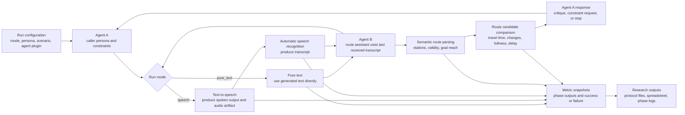

# MiniLlama

MiniLlama is a transit-route dialog sandbox with an optional `tkinter`/`ttk` graphical interface, batch evaluation, and session logging.

## Layout

### `minillama/`
Package root and module entrypoint.

- `__init__.py`: package marker.
- `__main__.py`: `python -m minillama` entrypoint.

### `minillama/agent_a/`
Agent A prompt logic and persona handling.

- `__init__.py`: package marker.
- `config.py`: Agent A defaults, personas, and prompt text constants.
- `agents.py`: Agent A prompt builders, cleanup, and fallback replies.
- `agent_a_responder.py`: template and large-language-model-backed Agent A responders.
- `personas.py`: persona lookup and preference formatting helpers.
- `prompt_data.py`: shared prompt context for Agent A and Agent B.

### `minillama/agent_b/`
Agent B prompting, plugins, and speech transport.

- `__init__.py`: package marker.
- `config.py`: Agent B defaults and speech-pattern settings.
- `plugin_registry.py`: built-in Agent B plugins, custom plugin loading, and plugin config.
- `pipeline.py`: Agent B verbal transformation pipeline.
- `speech_io.py`: pure-text and speech-mode transport with text-to-speech, automatic speech recognition, health checks, and diagnostics.

### `minillama/controller/`
Runtime orchestration, graphical interface startup, batch execution, and logging.

- `__init__.py`: package marker.
- `config.py`: controller defaults and logging profile.
- `dialog_manager.py`: one-dialog controller and route tracking.
- `dialog_result.py`: dialog result data model and null queue.
- `main.py`: interactive startup flow.
- `route_memory.py`: route deduplication memory.
- `run_experiments.py`: batch CLI entrypoint.
- `runner.py`: batch grid execution and CSV export.
- `session_logging.py`: configurable structured logging.

### `minillama/evaluation/`
Metrics and route interpretation.

- `__init__.py`: package marker.
- `config.py`: evaluation weights and scoring constants.
- `metrics.py`: automatic metric computation.
- `route_interpreter.py`: spoken-route parsing and scoring.

### `minillama/model/`
Transit network model and model-runtime helpers.

- `__init__.py`: package marker.
- `config.py`: model, network, and shared runtime settings.
- `metro_data.py`: generated network, crowding, and prompt text helpers.
- `model_adapters.py`: Hugging Face and OpenAI-compatible adapters.
- `model_runtime.py`: model/tokenizer loading and adapter creation.
- `network_overview.py`: complete line and station data rows for the graphical interface.
- `route_planner.py`: route validation, timing, and schedule helpers.
- `station_names.py`: station name generation.

### `minillama/test_cases/`
Scenarios and standardized evaluation cases.

- `__init__.py`: package marker.
- `config.py`: scenario and test-case defaults.
- `scenarios.py`: scenario construction and lookup.
- `test_cases.py`: standardized test-case binding and opening utterances.

### `minillama/view/`
Graphical interface rendering and view-layer layout.

- `__init__.py`: package marker.
- `config.py`: graphical interface layout, theme, and map constants.
- `gui.py`: interactive dashboard and transit map view.

### `tests/`
Regression tests for config facades, dialog monitoring, and session logging.

- `test_config_facades.py`: import and facade consistency checks.
- `test_dialog_manager_monitoring.py`: dialog telemetry coverage.
- `test_session_logging.py`: logging behavior checks.

## Run

Interactive graphical interface:

```powershell
.venv\Scripts\python.exe -m minillama
```

The graphical interface opens with a compact run-configuration form for run mode, scenario, persona, Agent B plugin, turn limits, early-stop limits, speech setup, and graphical interface mode. Agent B defaults to the MiniLlama/model-backed assistant and can optionally switch to the built-in deterministic planner or a custom `package.module:factory` plugin. The default interactive run is `pure_text`, which passes generated text directly between agents. Select `speech` mode to require text-to-speech and automatic speech recognition; the run performs a preflight check and stops with troubleshooting details if a stage does not produce audio or a transcript.

## Pipeline Overview



The conversation state always stores the result of the last completed pipeline phase. In `pure_text` mode that is generated text. In `speech` mode it is the automatic speech recognition transcript, so Agent B only reacts to what the speech pipeline produced. If text-to-speech or automatic speech recognition fails in speech mode, the run stops and records diagnostics instead of using the original generated text as a hidden fallback.

Batch metrics:

```powershell
.venv\Scripts\python.exe -m minillama.controller.run_experiments
```

Batch runs use the configured Agent B model adapter and the `--model-params` sweep maps to real generation presets. `--agent-b-plugin` is optional and defaults to `minillama`; use `simple` for the deterministic planner, `llm` as a compatibility alias, or `package.module:factory` for a custom plugin. `MINILLAMA_AGENT_B_PLUGIN` sets the same default for graphical interface and batch runs. Batch runs default to `pure_text` for low overhead; use `--run-mode speech` or `--speech-enabled` for speech-stage runs.

Useful speech-pipeline batch controls:

```powershell
.venv\Scripts\python.exe -m minillama.controller.run_experiments --agent-b-plugin simple --run-mode speech --speech-patterns clean,hesitant --speech-incoming true --speech-outgoing true --speech-scope both
```

- `--run-mode pure_text|speech`: choose direct text exchange or a strict speech pipeline.
- `--speech-incoming true|false`: include the incoming automatic speech recognition transcript stage.
- `--speech-outgoing true|false`: include the outgoing text-to-speech verbalization stage.
- `--speech-scope both|agent_a|agent_b|none`: choose whose turns pass through speech stages.
- `--speech-engine file|sapi|patterned`: use generated wave artifacts, Windows speech application programming interface stages, or text-pattern diagnostics.
- `--speech-audio-dir PATH`: directory for generated speech artifacts when `--speech-engine file` is active.
- `MINILLAMA_SPEECH_INCOMING`, `MINILLAMA_SPEECH_OUTGOING`, and `MINILLAMA_SPEECH_SCOPE` set the same defaults for graphical interface and batch runs.
- `--log-profile off|startup|runtime|full`: optional structured JSONL logging for batch audits. The default is `off` for low runtime overhead.
- `--log-dir PATH`: destination for optional batch logs.
- `--progress`: print each completed condition id during long batch runs.

## Metrics

The evaluation report exports a staged metric stack aligned with speech-dialog analysis. During runs, compact metric snapshots are emitted periodically to the live event stream and structured logs. After a conversation ends, the run writes protocol JSONL files, metric snapshots, an analysis-ready spreadsheet, and per-phase metric JSONL files. Pipeline metrics are derived from actual phase outputs: generated text, text-to-speech output, automatic speech recognition transcript, semantic parser input, route candidates, and final route state. Audio ingress, voice activity detection, and diarization fields are present when available; automatic speech recognition, spoken-language understanding and dialog-state tracking proxies, policy/tool metrics, natural-language generation, runtime, end-to-end, and post-hoc aggregates are computed from the dialog trace.

| Metric area | Primary phase output | Failure or success signal |
| --- | --- | --- |
| Pipeline phases | Run mode, phase attempts, text-to-speech output, automatic speech recognition transcript, semantic parser input | `pipeline_success_rate`, `pipeline_failure_count`, `pipeline_phase_output_dependency_rate` |
| Text-to-speech | Generated text, spoken text, audio artifact, playback status | `tts_success_rate`, `tts_failure_count`, `tts_text_change_rate` |
| Automatic speech recognition | Spoken text as source, recognized transcript as received input | `asr_success_rate`, `asr_failure_count`, `asr_word_error_rate`, station precision and recall |
| Spoken language understanding | Recognized transcript passed into route parsing | `slu_pipeline_input_match_rate`, route validity rate, goal reached rate |
| Route comparison | Parsed candidate route, duration, line changes, fullness, delay probability | candidate count, route revision count, constraint gaps |
| Runtime | Generation time, speech time, turn latency, condition runtime | mean latency, maximum turn latency, speech duration total |
| End to end | Final route and task state | task success, completion, abandonment, escalation, turns to success |

Speech turns keep separate generated, outgoing, and incoming text traces. The graphical interface and comma-separated metrics report automatic speech recognition word error rate, text-to-speech text-change rate, station precision and recall, and incoming/outgoing speech-stage enabled rates without duplicating those details in the conversation window.

Network data is displayed in its own graphical interface card with complete line rows, station rows, headways, current fullness, neighbors, route sequences, and segment travel times. The map remains separate so the data table can be scanned without depending on the drawing.

Logging defaults to `off`. Set `MINILLAMA_SESSION_LOG_PROFILE` to `startup`, `runtime`, or `full` to compare overhead.
